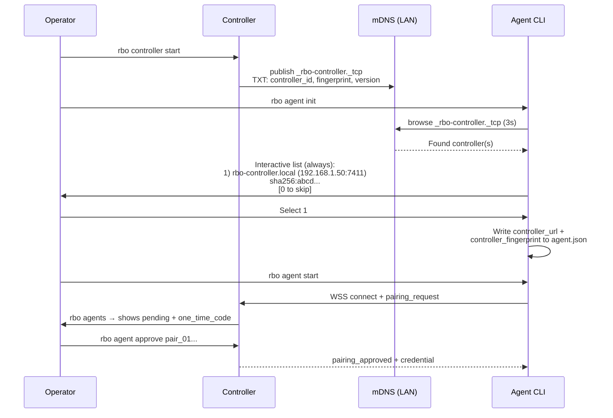

# mDNS Auto-Discovery & Streamlined Agent Pairing (v2)

Реалізація §7.2 "Наступна фаза" із design spec: контролер рекламує себе через mDNS/DNS-SD, агент автоматично знаходить контролер(и) в мережі при `rbo agent init`, оператор завжди підтверджує вибір інтерактивно.

## Resolved Decisions

- ✅ **Завжди інтерактивний вибір** — навіть якщо знайдено 1 контролер, показуємо список і просимо обрати. Ніякого auto-bind.
- ✅ **`mdns_display_name`** — default: `rbo-controller.local`
- ✅ **mDNS enabled by default** — `mdns_enabled: true`, вимикається через config або env var
- ✅ **`rbo agent reject <id>`** — підключаємо існуючий `rejectPairingRemote` до CLI

---

## Proposed Changes

### Overview



---

### New Package: `packages/discovery/`

Centralised mDNS advertisement and browsing logic, used by both Controller and Agent/CLI.

#### [NEW] [package.json](file:///c:/projects/gemslibe/rm-builder/packages/discovery/package.json)
- `@rbo/discovery` — depends on `bonjour-service`, `@rbo/shared`
- Exports: `ControllerAdvertiser`, `discoverControllers`, types

#### [NEW] [tsconfig.json](file:///c:/projects/gemslibe/rm-builder/packages/discovery/tsconfig.json)
- Extends `../../tsconfig.base.json`, follows monorepo convention

#### [NEW] [src/constants.ts](file:///c:/projects/gemslibe/rm-builder/packages/discovery/src/constants.ts)
- `RBO_MDNS_SERVICE_TYPE = 'rbo-controller'` → registers `_rbo-controller._tcp.local`
- `RBO_MDNS_BROWSE_TIMEOUT_MS = 3000` — default wait for discovery
- `RBO_MDNS_TXT_VERSION = '1'`

#### [NEW] [src/advertiser.ts](file:///c:/projects/gemslibe/rm-builder/packages/discovery/src/advertiser.ts)
- `ControllerAdvertiser` class:
  ```ts
  interface AdvertiserOptions {
    port: number;              // agent_plane_port (7411)
    controllerId: string;      // controller_01J...
    fingerprint: string;       // sha256:...
    displayName?: string;      // default: 'rbo-controller.local'
  }
  
  class ControllerAdvertiser {
    start(options: AdvertiserOptions): void;   // bonjour.publish()
    stop(): Promise<void>;                     // bonjour.unpublishAll() + destroy()
  }
  ```
- TXT records published (matches §7.2 spec):
  ```
  version=1
  tls=1
  pairing=required
  controller_id=<id>
  fingerprint=<sha256:hex>
  ```

#### [NEW] [src/browser.ts](file:///c:/projects/gemslibe/rm-builder/packages/discovery/src/browser.ts)
- `discoverControllers()` function:
  ```ts
  interface DiscoveredController {
    name: string;               // mDNS instance name
    host: string;               // resolved hostname
    addresses: string[];        // IPv4/IPv6
    port: number;               // 7411
    controllerId: string;       // from TXT
    fingerprint: string;        // from TXT
    version: string;            // from TXT
  }
  
  async function discoverControllers(options?: {
    timeoutMs?: number;         // default 3000
  }): Promise<DiscoveredController[]>;
  ```
- Uses `bonjour.find({ type: 'rbo-controller' })` with timeout
- Deduplicates by `controllerId`
- Returns sorted array (by name)
- Destroys bonjour instance after browsing completes

#### [NEW] [src/index.ts](file:///c:/projects/gemslibe/rm-builder/packages/discovery/src/index.ts)
- Re-exports: `ControllerAdvertiser`, `discoverControllers`, `DiscoveredController`, constants

#### [NEW] [src/\_\_tests\_\_/discovery.test.ts](file:///c:/projects/gemslibe/rm-builder/packages/discovery/src/__tests__/discovery.test.ts)
- Unit test: publish → browse → finds service with correct TXT records → unpublish → gone
- Test: browse with no publishers → returns `[]` after timeout
- Test: deduplication by `controllerId`

---

### Controller: Advertise on Startup

#### [MODIFY] [config.ts](file:///c:/projects/gemslibe/rm-builder/apps/controller/src/config.ts)
- Add to `ControllerConfigFileSchema`:
  ```ts
  mdns_enabled: z.boolean().optional(),              // default: true
  mdns_display_name: z.string().min(1).optional(),   // default: 'rbo-controller.local'
  ```
- Add to `ControllerConfig` interface: `mdnsEnabled: boolean`, `mdnsDisplayName: string`
- Add to `defaultControllerConfigFile()`: `mdns_enabled: true`, `mdns_display_name: 'rbo-controller.local'`
- Wire env var `RBO_MDNS_ENABLED` (`'true'`/`'false'`/`'0'`/`'1'` parse)

#### [MODIFY] [run.ts](file:///c:/projects/gemslibe/rm-builder/apps/controller/src/run.ts)
- After `startAgentPlaneServer`, if `config.mdnsEnabled`:
  ```ts
  import { ControllerAdvertiser } from '@rbo/discovery';
  
  const advertiser = new ControllerAdvertiser();
  advertiser.start({
    port: agentPlane.port,
    controllerId: identity.controllerId,
    fingerprint: identity.fingerprint,
    displayName: config.mdnsDisplayName,
  });
  logger.info('mDNS advertisement started', {
    type: '_rbo-controller._tcp',
    displayName: config.mdnsDisplayName,
  });
  ```
- In `shutdown()`: `await advertiser.stop();` (sends mDNS goodbye packet with TTL=0)
- If `!config.mdnsEnabled`: log info-level "mDNS advertisement disabled"

---

### Agent: Discover on Init (Always Interactive)

#### [MODIFY] [config.ts](file:///c:/projects/gemslibe/rm-builder/apps/agent/src/config.ts)
- `writeDefaultAgentConfigFile` gains optional `discovery` param:
  ```ts
  interface DiscoveryResult {
    controllerUrl: string;
    controllerFingerprint: string;
  }
  ```
- If provided, writes those values instead of empty strings for `controller_url` / `controller_fingerprint`

#### [MODIFY] [agent.ts](file:///c:/projects/gemslibe/rm-builder/apps/cli/src/commands/agent.ts)
- `runAgentInit` flow:
  1. Write default `agent.json` (as today, with empty `controller_url`)
  2. If `controller_url` is empty in the written config → run `discoverControllers()`
  3. If 0 found → print hint: `"No controllers found on local network. Edit agent.json manually or set RBO_CONTROLLER_URL."`
  4. If ≥1 found → **always** show numbered list with interactive prompt:
     ```
     Scanning for RBO controllers on local network...
     
     Found 2 controller(s):
       1) rbo-controller.local (192.168.1.50:7411)
          controller_01JXYZ...  fingerprint: sha256:abcd1234...
       2) mbp-build (192.168.1.60:7411)
          controller_01JABC...  fingerprint: sha256:efgh5678...
       0) Skip — configure manually later
     
     Select controller [1-2, 0 to skip]: _
     ```
  5. On valid selection → rewrite `agent.json` with `controller_url: wss://<ip>:<port>/agent` and `controller_fingerprint: <fingerprint>`
  6. On `0` or non-TTY → leave `agent.json` with empty fields, print manual config hint
  7. Return result with `discovered: boolean`, `controllerName?: string`

- Non-TTY behaviour: discovery still runs, but prints the list and hint without prompting (same as `0`/skip)

---

### CLI: Wire `rbo agent reject`

#### [MODIFY] [main.ts](file:///c:/projects/gemslibe/rm-builder/apps/cli/src/main.ts)
- Add handler for `sub === 'reject'` at ~line 159, alongside existing `approve`/`revoke`:
  ```ts
  if (sub === 'reject') {
    const requestId = agentArgs[1];
    if (!requestId) throw new Error('Usage: rbo agent reject <pairing-request-id>');
    await rejectPairingRemote(controllerUrl, requestId);
    console.log(`rejected ${requestId}`);
    return;
  }
  ```
- Import `rejectPairingRemote` from `./commands/agents.js` (already exported, just not imported in `main.ts`)
- Update error message at line 226 to include `reject`

---

### CLI: Add `rbo discover` (Standalone)

For ad-hoc discovery without modifying agent config.

#### [NEW] [discover.ts](file:///c:/projects/gemslibe/rm-builder/apps/cli/src/commands/discover.ts)
- `runDiscover()`: calls `discoverControllers()`, prints formatted table:
  ```
  Scanning for RBO controllers on local network...
  
  Found 2 controller(s):
    Name                  Address          Port   Controller ID         Fingerprint
    rbo-controller.local  192.168.1.50     7411   controller_01JX...    sha256:abcd...
    mbp-build             192.168.1.60     7411   controller_01JA...    sha256:efgh...
  ```
- If 0 found: `"No RBO controllers found on local network."`

#### [MODIFY] [main.ts](file:///c:/projects/gemslibe/rm-builder/apps/cli/src/main.ts)
- Add `case 'discover':` routing to `runDiscover()`

---

### Help & Documentation

#### [MODIFY] [help.ts](file:///c:/projects/gemslibe/rm-builder/apps/cli/src/commands/help.ts)
- Add to help text:
  ```
  discover                               Scan LAN for RBO controllers via mDNS
  agent reject <pairing-request-id>      Reject a pending pairing request
  ```

#### [MODIFY] [getting-started.md](file:///c:/projects/gemslibe/rm-builder/docs/user/getting-started.md)
- Update Worker Setup: explain that `rbo agent init` scans for controllers, operator picks from list
- Keep manual fallback instructions for headless/non-TTY setups

#### [MODIFY] [runbook.md](file:///c:/projects/gemslibe/rm-builder/docs/user/runbook.md)
- Add "Rejecting a pairing request" section: `rbo agent reject <id>`
- Add "Disabling mDNS": set `mdns_enabled: false` in `controller.json` or `RBO_MDNS_ENABLED=false`

#### [MODIFY] [remote-build-orchestrator-design.md](file:///c:/projects/gemslibe/rm-builder/remote-build-orchestrator-design.md)
- Update §7.2: mark mDNS/DNS-SD as implemented, remove "Наступна фаза" label
- Add `packages/discovery/` to repo map section

---

### Monorepo Wiring

#### [MODIFY] [pnpm-workspace.yaml](file:///c:/projects/gemslibe/rm-builder/pnpm-workspace.yaml)
- Add `packages/discovery` to workspace packages list

#### [MODIFY] [tsconfig.base.json](file:///c:/projects/gemslibe/rm-builder/tsconfig.base.json)
- Add path mapping: `"@rbo/discovery": ["packages/discovery/src/index.ts"]` and `"@rbo/discovery/*": ["packages/discovery/src/*"]`

#### [MODIFY] [apps/controller/package.json](file:///c:/projects/gemslibe/rm-builder/apps/controller/package.json)
- Add `"@rbo/discovery": "workspace:*"` to dependencies

#### [MODIFY] [apps/cli/package.json](file:///c:/projects/gemslibe/rm-builder/apps/cli/package.json)
- Add `"@rbo/discovery": "workspace:*"` to dependencies

---

## Summary of File Changes

| Action | File | Purpose |
|--------|------|---------|
| **NEW** | `packages/discovery/package.json` | Package manifest, `bonjour-service` dep |
| **NEW** | `packages/discovery/tsconfig.json` | TypeScript config |
| **NEW** | `packages/discovery/src/constants.ts` | mDNS service type, timeouts |
| **NEW** | `packages/discovery/src/advertiser.ts` | Controller mDNS publisher |
| **NEW** | `packages/discovery/src/browser.ts` | Agent/CLI mDNS browser |
| **NEW** | `packages/discovery/src/index.ts` | Barrel exports |
| **NEW** | `packages/discovery/src/__tests__/discovery.test.ts` | Advertiser + browser tests |
| **NEW** | `apps/cli/src/commands/discover.ts` | `rbo discover` command |
| MODIFY | `apps/controller/src/config.ts` | `mdns_enabled`, `mdns_display_name` |
| MODIFY | `apps/controller/src/run.ts` | Start/stop mDNS advertiser |
| MODIFY | `apps/agent/src/config.ts` | Accept discovery result |
| MODIFY | `apps/cli/src/commands/agent.ts` | Discovery flow in `runAgentInit` |
| MODIFY | `apps/cli/src/main.ts` | Wire `discover`, `agent reject` |
| MODIFY | `apps/cli/src/commands/help.ts` | Updated help text |
| MODIFY | `pnpm-workspace.yaml` | Add workspace entry |
| MODIFY | `tsconfig.base.json` | Path mapping |
| MODIFY | `apps/controller/package.json` | Add dep |
| MODIFY | `apps/cli/package.json` | Add dep |
| MODIFY | `docs/user/getting-started.md` | Updated setup flow |
| MODIFY | `docs/user/runbook.md` | Reject + mDNS docs |
| MODIFY | `remote-build-orchestrator-design.md` | Mark §7.2 implemented |

---

## Verification Plan

### Automated Tests
```bash
# Discovery package unit/integration tests
pnpm exec vitest run packages/discovery/src/__tests__/discovery.test.ts

# Existing agent config tests still pass
pnpm --filter @rbo/agent test

# Existing controller config tests still pass  
pnpm --filter @rbo/controller test

# CLI tests (if any)
pnpm --filter @rbo/cli test

# Final gate
pnpm format
pnpm verify
```

### Manual Verification
1. `rbo controller start` → verify log line "mDNS advertisement started"
2. `rbo discover` → should list the controller with name `rbo-controller.local`
3. `rbo agent init` → should show list with 1 entry, ask to select, write to `agent.json`
4. Verify `agent.json` has correct `controller_url` and `controller_fingerprint`
5. `rbo agent start` → should connect and enter `pairing_pending`
6. `rbo agents` → should show pending pairing
7. `rbo agent reject <id>` → should reject the pairing, verify in `rbo agents`
8. Test with `mdns_enabled: false` in `controller.json` → `rbo discover` shows 0, `rbo agent init` prints manual hint
9. Test non-TTY: `echo "" | rbo agent init` → should print list but skip, leave config empty
