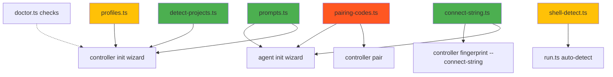

# Implementation Plan: RBO UX, Configuration & Security Improvements

Детальний план реалізації всіх 8 покращень, розбитий на 3 фази.

---

## Phase 1 — Quick Wins + High Impact

### 1.1 Interactive Wizard для `controller init` та `agent init`

Зараз `controller init` просто записує дефолтний JSON-файл. Додаємо інтерактивний TTY-режим з автодетектом, зберігаючи `--non-interactive` для CI.

---

#### [MODIFY] [flags.ts](file:///c:/projects/gemslibe/rm-builder/apps/cli/src/commands/flags.ts)

Додати парсер `parseNonInteractiveFlag`:

```typescript
export function parseNonInteractiveFlag(rest: string[]): boolean {
  const idx = rest.indexOf('--non-interactive');
  if (idx >= 0) { rest.splice(idx, 1); return true; }
  return !process.stdin.isTTY;
}
```

---

#### [NEW] [prompts.ts](file:///c:/projects/gemslibe/rm-builder/apps/cli/src/commands/prompts.ts)

Спільний модуль інтерактивних промптів на основі `node:readline/promises` (жодних нових залежностей):

```typescript
import { createInterface } from 'node:readline/promises';

/** Запитати текстове значення з дефолтом. */
export async function promptText(label: string, defaultValue?: string): Promise<string>;

/** Запитати y/n з дефолтом. */
export async function promptYesNo(label: string, defaultYes?: boolean): Promise<boolean>;

/** Показати нумерований список і запитати вибір. */
export async function promptSelect<T>(label: string, items: { display: string; value: T }[]): Promise<T>;

/** Запитати список шляхів (comma-separated або по одному). */
export async function promptPaths(label: string, suggestions?: string[]): Promise<string[]>;
```

---

#### [NEW] [detect-projects.ts](file:///c:/projects/gemslibe/rm-builder/apps/cli/src/commands/detect-projects.ts)

Автодетект проєктних директорій та git remote хостів:

```typescript
/** Сканує типові локації на наявність .git директорій. */
export function detectProjectRoots(): string[];

/** Витягує унікальні git remote хости з виявлених репозиторіїв. */
export function detectGitRemoteHosts(roots: string[]): string[];
```

Типові локації для сканування:
- Windows: `C:\projects`, `%USERPROFILE%\repos`, `%USERPROFILE%\source\repos`
- macOS/Linux: `~/projects`, `~/repos`, `~/src`, `~/code`, `~/work`
- Глибина сканування: 2 рівні (щоб знайти `~/projects/myapp/.git`)

---

#### [MODIFY] [controller.ts](file:///c:/projects/gemslibe/rm-builder/apps/cli/src/commands/controller.ts)

Розширити `runControllerInit`:

```typescript
async function runControllerInit(rest: string[]): Promise<void> {
  const force = parseForceFlag(rest);
  const nonInteractive = parseNonInteractiveFlag(rest);

  // ... existing identity generation ...

  if (nonInteractive) {
    // Поточна поведінка — записати дефолт
    writeDefaultControllerConfigFile(dataDir, { force });
  } else {
    // Інтерактивний wizard
    const config = await runControllerWizard(dataDir);
    writeControllerConfigFile(dataDir, config, { force });
  }
}
```

Wizard flow:
1. Автодетект project roots → `promptPaths('Project repositories:', detected)`
2. Автодетект git remote hosts → показати які буде додано в allowlist
3. Визначити `controller_public_host` через `selectBestAddress()` з `@rbo/discovery`
4. `promptText('MCP port:', '7410')`
5. `promptYesNo('Enable mDNS discovery?', true)`
6. `promptText('Display name:', hostname())`
7. Показати підсумок → `promptYesNo('Save this configuration?', true)`

---

#### [MODIFY] [agent.ts](file:///c:/projects/gemslibe/rm-builder/apps/cli/src/commands/agent.ts)

Розширити `runAgentInit` wizard-кроком для ручного введення URL, коли mDNS не знайшов контролерів:

```typescript
if (controllers.length === 0 && !nonInteractive) {
  console.error('No controllers found via mDNS.');
  const choice = await promptSelect('How to connect?', [
    { display: 'Enter controller URL manually', value: 'manual' },
    { display: 'Use a connect-string', value: 'connect' },
    { display: 'Cancel', value: 'cancel' },
  ]);
  // ... handle each choice
}
```

---

#### Тести

#### [NEW] [wizard.test.ts](file:///c:/projects/gemslibe/rm-builder/apps/cli/test/wizard.test.ts)

- Тест `detectProjectRoots()` з мок-файловою системою
- Тест `detectGitRemoteHosts()` з мок-git-репо
- Тест `promptSelect` з симульованим stdin

---

### 1.2 Розумний Git Allowlist

---

#### [MODIFY] [config.ts](file:///c:/projects/gemslibe/rm-builder/apps/controller/src/config.ts)

Додати helper для роботи з allowlist:

```typescript
/** Додає хост до git_allowlist у файлі конфігурації. */
export function addGitAllowlistHost(configPath: string, host: string): void;

/** Перевіряє чи хост дозволений. */
export function isGitHostAllowed(config: ControllerConfig, host: string): boolean;
```

---

#### [MODIFY] [controller.ts](file:///c:/projects/gemslibe/rm-builder/apps/cli/src/commands/controller.ts)

Додати субкоманду `rbo controller allow-host <host>`:

```typescript
case 'allow-host':
  const host = rest[0];
  addGitAllowlistHost(configPath, host);
  console.error(`✅ Added ${host} to git_allowlist`);
```

---

#### [MODIFY] [run.ts](file:///c:/projects/gemslibe/rm-builder/apps/controller/src/run.ts)

У flow `job_run`, при git remote validation — повертати чітке повідомлення:

```typescript
// Замість generic помилки:
throw new UserFacingError(
  `Git host "${remoteHost}" is not in git_allowlist. ` +
  `Run: rbo controller allow-host ${remoteHost}`
);
```

---

#### [MODIFY] [config.test.ts](file:///c:/projects/gemslibe/rm-builder/apps/controller/test/config.test.ts)

Тест `addGitAllowlistHost` — додає хост, зберігає файл, перечитує.

---

### 1.3 Proactive `rbo doctor`

---

#### [MODIFY] [doctor.ts](file:///c:/projects/gemslibe/rm-builder/apps/cli/src/commands/doctor.ts)

Додати нові секції перевірок:

```typescript
// ─── Configuration Checks ───
async function checkAllowedRoots(config: ControllerConfig): Promise<DiagRow>;
async function checkGitAllowlistCoverage(config: ControllerConfig): Promise<DiagRow>;
async function checkMdnsDisplayNameUnique(config: ControllerConfig): Promise<DiagRow>;
async function checkSnapshotLimits(config: ControllerConfig): Promise<DiagRow>;

// ─── Agent Fleet Checks ───
async function checkAgentOsCoverage(agents: AgentInfo[]): Promise<DiagRow>;
async function checkTlsCertExpiry(identity: ControllerIdentity): Promise<DiagRow>;
```

Логіка перевірок:
- `allowed_project_roots` порожній → `WARN: No jobs can run. Add paths via controller init or allow-host`
- `git_allowlist.hosts` не покриває remote хости з `allowed_project_roots` → `WARN`
- TLS сертифікат < 30 днів до закінчення → `WARN`
- Жодного агента з `target_os=windows` → `INFO: Windows jobs will fail`
- `mdns_display_name` = default + >1 контролер в мережі → `WARN: Use unique names`

---

#### [NEW] [doctor.test.ts](file:///c:/projects/gemslibe/rm-builder/apps/cli/test/doctor.test.ts)

Тести для нових діагностичних перевірок з мок-конфігами.

---

### 1.4 Connect-String + mDNS Fallback

---

#### [NEW] [connect-string.ts](file:///c:/projects/gemslibe/rm-builder/packages/shared/src/connect-string.ts)

```typescript
export interface ConnectInfo {
  host: string;
  port: number;
  fingerprint: string;  // sha256:hex...
}

/** Серіалізує connection info у компактний URI. */
export function encodeConnectString(info: ConnectInfo): string;
// → rbo://192.168.1.10:7411?fp=sha256:ab12cd...

/** Парсить connect-string назад у ConnectInfo. */
export function decodeConnectString(str: string): ConnectInfo;
```

---

#### [MODIFY] [index.ts](file:///c:/projects/gemslibe/rm-builder/packages/shared/src/index.ts)

Реекспорт `connect-string.ts`.

---

#### [MODIFY] [controller.ts](file:///c:/projects/gemslibe/rm-builder/apps/cli/src/commands/controller.ts)

Розширити `rbo controller fingerprint`:

```typescript
case 'fingerprint': {
  // Existing: print fingerprint
  if (rest.includes('--connect-string')) {
    const identity = loadControllerIdentity(dataDir);
    const config = loadControllerConfig({ dataDir });
    const cs = encodeConnectString({
      host: config.controllerPublicHost,
      port: config.agentPlanePort,
      fingerprint: identity.fingerprint,
    });
    console.log(cs);
  }
}
```

---

#### [MODIFY] [agent.ts](file:///c:/projects/gemslibe/rm-builder/apps/cli/src/commands/agent.ts)

Додати `--connect` flag:

```typescript
// rbo agent init --connect rbo://192.168.1.10:7411?fp=sha256:...
const connectStr = parseStringFlag(rest, '--connect');
if (connectStr) {
  const info = decodeConnectString(connectStr);
  // Записати controllerUrl та controllerFingerprint в agent.json
}
```

---

#### [NEW] [connect-string.test.ts](file:///c:/projects/gemslibe/rm-builder/packages/shared/test/connect-string.test.ts)

- Roundtrip encode→decode
- IPv6 адреси в URL (`rbo://[::1]:7411?fp=...`)
- Невалідні рядки → помилка
- Відсутній fingerprint → помилка

---

### 1.5 `.env.example` Шаблони

---

#### [NEW] [env-template.ts](file:///c:/projects/gemslibe/rm-builder/apps/cli/src/commands/env-template.ts)

```typescript
export function generateControllerEnvTemplate(): string;
export function generateAgentEnvTemplate(): string;
```

---

#### [MODIFY] [controller.ts](file:///c:/projects/gemslibe/rm-builder/apps/cli/src/commands/controller.ts)

У `runControllerInit` після запису `controller.json` — записати `.env.example` поруч:

```typescript
const envPath = join(dataDir, '.env.example');
if (!existsSync(envPath)) {
  writeFileSync(envPath, generateControllerEnvTemplate(), 'utf8');
  console.error(`  📄 ${envPath}`);
}
```

---

#### Тести — юніт-тест `generateControllerEnvTemplate()` перевіряє наявність всіх `RBO_*` ключів.

---

## Phase 2 — Smart Defaults

### 2.1 Auto-detect Shell & Target OS

---

#### [NEW] [shell-detect.ts](file:///c:/projects/gemslibe/rm-builder/apps/cli/src/commands/shell-detect.ts)

```typescript
interface ShellHint {
  shell: 'bash' | 'powershell' | 'cmd' | 'sh';
  targetOs: 'linux' | 'darwin' | 'win32';
  confidence: 'high' | 'medium' | 'low';
  reason: string;
}

/** Евристично визначає shell і OS за командою та доступними агентами. */
export function detectShellAndOs(
  command: string,
  availableAgents: { os: string; online: boolean }[],
): ShellHint;
```

Евристики:
| Патерн у команді | Shell | OS | Confidence |
|---|---|---|---|
| `make`, `gcc`, `apt`, `dpkg`, `systemctl` | `bash` | `linux` | high |
| `brew`, `xcodebuild`, `xcrun` | `zsh` | `darwin` | high |
| `msbuild`, `choco`, `winget`, `*.ps1` | `powershell` | `win32` | high |
| `npm`, `pnpm`, `cargo`, `python` | detect by agent | agent OS | low |
| Тільки 1 агент онлайн | agent's shell | agent OS | medium |

---

#### [MODIFY] [run.ts](file:///c:/projects/gemslibe/rm-builder/apps/cli/src/commands/run.ts)

Інтегрувати `detectShellAndOs`:

```typescript
if (!explicitShell && !explicitTargetOs) {
  const hint = detectShellAndOs(command, agents);
  if (hint.confidence !== 'low' && process.stdin.isTTY) {
    console.error(`💡 Detected: --shell ${hint.shell} --target-os ${hint.targetOs} (${hint.reason})`);
    // Використати, але дозволити override через --strict
  }
}
```

---

#### [NEW] [shell-detect.test.ts](file:///c:/projects/gemslibe/rm-builder/apps/cli/test/shell-detect.test.ts)

Параметризовані тести для кожної евристики.

---

### 2.2 Config Profiles

---

#### [NEW] [profiles.ts](file:///c:/projects/gemslibe/rm-builder/apps/cli/src/commands/profiles.ts)

```typescript
export type ProfileName = 'solo' | 'team' | 'enterprise' | 'minimal';

export interface ConfigProfile {
  name: ProfileName;
  display: string;
  description: string;
  overrides: Partial<ControllerConfigFile>;
}

export const CONFIG_PROFILES: ConfigProfile[] = [
  {
    name: 'solo',
    display: 'Solo developer',
    description: 'Single machine, relaxed security, local fallback enabled',
    overrides: {
      allow_local_fallback: true,
      allow_full_snapshot_fallback: true,
      default_queue_policy: 'local_fallback',
      mdns_enabled: true,
    },
  },
  {
    name: 'team',
    display: 'Small team',
    description: 'LAN with agents, standard security',
    overrides: {
      allow_local_fallback: true,
      allow_full_snapshot_fallback: false,
      default_queue_policy: 'wait',
      mdns_enabled: true,
    },
  },
  {
    name: 'enterprise',
    display: 'Enterprise',
    description: 'Strict allowlists, no local fallback, audit-ready',
    overrides: {
      allow_local_fallback: false,
      allow_full_snapshot_fallback: false,
      default_queue_policy: 'fail_fast',
      mdns_enabled: false,
    },
  },
  {
    name: 'minimal',
    display: 'Minimal',
    description: 'Bare defaults, configure manually',
    overrides: {},
  },
];
```

---

#### [MODIFY] [controller.ts](file:///c:/projects/gemslibe/rm-builder/apps/cli/src/commands/controller.ts)

Інтегрувати вибір профілю у wizard:

```typescript
const profile = await promptSelect('Configuration profile:', 
  CONFIG_PROFILES.map(p => ({ display: `${p.display} — ${p.description}`, value: p }))
);
const config = { ...defaultControllerConfigFile(), ...profile.overrides, ...wizardOverrides };
```

Також додати `rbo controller init --profile solo` для non-interactive:

```typescript
const profileName = parseStringFlag(rest, '--profile');
```

---

#### [NEW] [profiles.test.ts](file:///c:/projects/gemslibe/rm-builder/apps/cli/test/profiles.test.ts)

- Кожен профіль проходить валідацію `ControllerConfigFileSchema`
- Профілі не конфліктують між собою

---

## Phase 3 — Advanced Security UX

### 3.1 Short-Code Pairing

Це найскладніша зміна, бо вимагає нового HTTP endpoint на контролері та тимчасового стану.

---

#### [NEW] [pairing-codes.ts](file:///c:/projects/gemslibe/rm-builder/apps/controller/src/pairing-codes.ts)

```typescript
interface PairingCode {
  code: string;           // "ALPHA-BRAVO-7429"
  fingerprint: string;    // sha256:...
  createdAt: number;
  expiresAt: number;      // createdAt + 5min
  used: boolean;
}

export class PairingCodeManager {
  /** Генерує новий одноразовий код, зв'язаний з fingerprint контролера. */
  generate(fingerprint: string): PairingCode;

  /** Верифікує код. Повертає fingerprint або null якщо невалідний/expired/used. */
  verify(code: string): string | null;

  /** Очищає expired коди. */
  cleanup(): void;
}
```

Формат коду: `WORD-WORD-NNNN` (2 слова з wordlist + 4 цифри = ~10M комбінацій).

---

#### [NEW] [pairing-wordlist.ts](file:///c:/projects/gemslibe/rm-builder/apps/controller/src/pairing-wordlist.ts)

Список ~256 простих англійських слів (ALPHA, BRAVO, CHARLIE, ..., ZULU + доповнення).

---

#### [MODIFY] [run.ts](file:///c:/projects/gemslibe/rm-builder/apps/controller/src/run.ts)

Додати два нових internal HTTP endpoints:

```typescript
// POST /internal/v1/pairing/generate
// → { code: "ALPHA-BRAVO-7429", expires_in: 300 }

// POST /internal/v1/pairing/verify
// Body: { code: "ALPHA-BRAVO-7429" }
// → { fingerprint: "sha256:...", controller_url: "wss://..." } або 401
```

---

#### [MODIFY] [controller.ts](file:///c:/projects/gemslibe/rm-builder/apps/cli/src/commands/controller.ts)

Додати `rbo controller pair`:

```typescript
case 'pair': {
  const resp = await fetch(`${internalUrl}/pairing/generate`, { method: 'POST' });
  const { code, expires_in } = await resp.json();
  console.log(`🔑 Pairing code: ${code}`);
  console.log(`   Valid for ${expires_in / 60} minutes.`);
}
```

---

#### [MODIFY] [agent.ts](file:///c:/projects/gemslibe/rm-builder/apps/cli/src/commands/agent.ts)

В інтерактивному wizard додати опцію "Enter pairing code":

```typescript
const code = await promptText('Pairing code:');
const resp = await fetch(`https://${host}:${port}/internal/v1/pairing/verify`, {
  method: 'POST',
  body: JSON.stringify({ code }),
  // TLS: перший запит без перевірки fingerprint, бо ми його отримаємо з відповіді
  // Другий запит — вже з pin
});
```

> [!WARNING]
> **Безпекове рішення:** Перший запит на `/pairing/verify` має відбуватись з TLS, але без fingerprint pinning (бо агент ще не знає fingerprint). Відповідь повертає fingerprint, після чого агент верифікує що TLS сертифікат сервера справді відповідає цьому fingerprint. Це TOFU-модель (Trust On First Use), захищена одноразовим кодом як proof-of-physical-access.

---

#### Тести

#### [NEW] [pairing-codes.test.ts](file:///c:/projects/gemslibe/rm-builder/apps/controller/test/pairing-codes.test.ts)

- Генерація коду → верифікація → success
- Повторне використання → failure
- Expired код → failure
- Cleanup видаляє старі коди
- Формат коду відповідає `WORD-WORD-NNNN` 

---

## Зведена карта файлів

### Нові файли (14)

| Фаза | Пакет | Файл |
|---|---|---|
| 1 | `apps/cli` | [prompts.ts](file:///c:/projects/gemslibe/rm-builder/apps/cli/src/commands/prompts.ts) |
| 1 | `apps/cli` | [detect-projects.ts](file:///c:/projects/gemslibe/rm-builder/apps/cli/src/commands/detect-projects.ts) |
| 1 | `apps/cli` | [env-template.ts](file:///c:/projects/gemslibe/rm-builder/apps/cli/src/commands/env-template.ts) |
| 1 | `apps/cli/test` | [wizard.test.ts](file:///c:/projects/gemslibe/rm-builder/apps/cli/test/wizard.test.ts) |
| 1 | `apps/cli/test` | [doctor.test.ts](file:///c:/projects/gemslibe/rm-builder/apps/cli/test/doctor.test.ts) |
| 1 | `packages/shared` | [connect-string.ts](file:///c:/projects/gemslibe/rm-builder/packages/shared/src/connect-string.ts) |
| 1 | `packages/shared/test` | [connect-string.test.ts](file:///c:/projects/gemslibe/rm-builder/packages/shared/test/connect-string.test.ts) |
| 2 | `apps/cli` | [shell-detect.ts](file:///c:/projects/gemslibe/rm-builder/apps/cli/src/commands/shell-detect.ts) |
| 2 | `apps/cli` | [profiles.ts](file:///c:/projects/gemslibe/rm-builder/apps/cli/src/commands/profiles.ts) |
| 2 | `apps/cli/test` | [shell-detect.test.ts](file:///c:/projects/gemslibe/rm-builder/apps/cli/test/shell-detect.test.ts) |
| 2 | `apps/cli/test` | [profiles.test.ts](file:///c:/projects/gemslibe/rm-builder/apps/cli/test/profiles.test.ts) |
| 3 | `apps/controller` | [pairing-codes.ts](file:///c:/projects/gemslibe/rm-builder/apps/controller/src/pairing-codes.ts) |
| 3 | `apps/controller` | [pairing-wordlist.ts](file:///c:/projects/gemslibe/rm-builder/apps/controller/src/pairing-wordlist.ts) |
| 3 | `apps/controller/test` | [pairing-codes.test.ts](file:///c:/projects/gemslibe/rm-builder/apps/controller/test/pairing-codes.test.ts) |

### Модифіковані файли (11)

| Фаза | Файл | Зміна |
|---|---|---|
| 1 | [flags.ts](file:///c:/projects/gemslibe/rm-builder/apps/cli/src/commands/flags.ts) | `parseNonInteractiveFlag`, `parseStringFlag` |
| 1 | [controller.ts](file:///c:/projects/gemslibe/rm-builder/apps/cli/src/commands/controller.ts) | Wizard flow, `allow-host`, `fingerprint --connect-string` |
| 1 | [agent.ts](file:///c:/projects/gemslibe/rm-builder/apps/cli/src/commands/agent.ts) | mDNS fallback menu, `--connect` flag |
| 1 | [config.ts](file:///c:/projects/gemslibe/rm-builder/apps/controller/src/config.ts) | `addGitAllowlistHost`, `isGitHostAllowed` |
| 1 | [config.test.ts](file:///c:/projects/gemslibe/rm-builder/apps/controller/test/config.test.ts) | Тести allowlist helpers |
| 1 | [doctor.ts](file:///c:/projects/gemslibe/rm-builder/apps/cli/src/commands/doctor.ts) | 6 нових перевірок |
| 1 | [index.ts](file:///c:/projects/gemslibe/rm-builder/packages/shared/src/index.ts) | Реекспорт connect-string |
| 2 | [run.ts](file:///c:/projects/gemslibe/rm-builder/apps/cli/src/commands/run.ts) | Shell/OS auto-detect інтеграція |
| 2 | [help.ts](file:///c:/projects/gemslibe/rm-builder/apps/cli/src/commands/help.ts) | Документація нових flags/commands |
| 3 | [run.ts](file:///c:/projects/gemslibe/rm-builder/apps/controller/src/run.ts) | Pairing HTTP endpoints |
| 3 | [main.ts](file:///c:/projects/gemslibe/rm-builder/apps/cli/src/main.ts) | `controller pair` routing |

---

## Залежності між змінами



---

## Документація

#### [MODIFY] [getting-started.md](file:///c:/projects/gemslibe/rm-builder/docs/user/getting-started.md)

- Оновити розділ setup з wizard-прикладами
- Додати `connect-string` flow
- Додати `--profile` приклади

#### [MODIFY] [runbook.md](file:///c:/projects/gemslibe/rm-builder/docs/user/runbook.md)

- Додати `rbo controller allow-host` процедуру
- Додати `rbo controller pair` процедуру
- Оновити troubleshooting з новими `doctor` перевірками

---

## Verification Plan

### Automated Tests
```bash
# Після кожної фази:
pnpm format
pnpm verify

# Targeted під час розробки:
pnpm exec vitest run apps/cli/test/wizard.test.ts
pnpm exec vitest run packages/shared/test/connect-string.test.ts
pnpm exec vitest run apps/cli/test/shell-detect.test.ts
pnpm exec vitest run apps/controller/test/pairing-codes.test.ts
```

### Manual Verification
- Запустити `rbo controller init` в TTY → перевірити wizard flow
- Запустити `rbo controller init --non-interactive` → перевірити зворотну сумісність
- Запустити `rbo doctor` → перевірити нові діагностики
- Перевірити `rbo controller fingerprint --connect-string` → `rbo agent init --connect <string>` roundtrip
- Перевірити `rbo controller pair` → `rbo agent init` з кодом

> [!IMPORTANT]
> Яку фазу починаємо першою? Або є зміни до плану?
