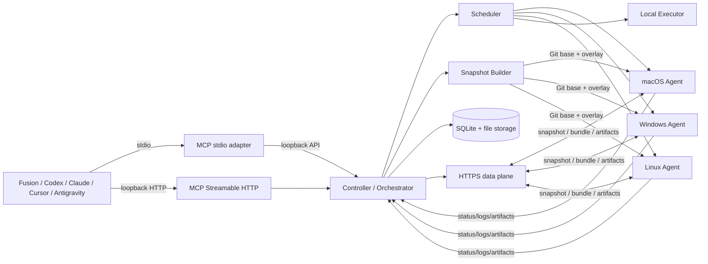
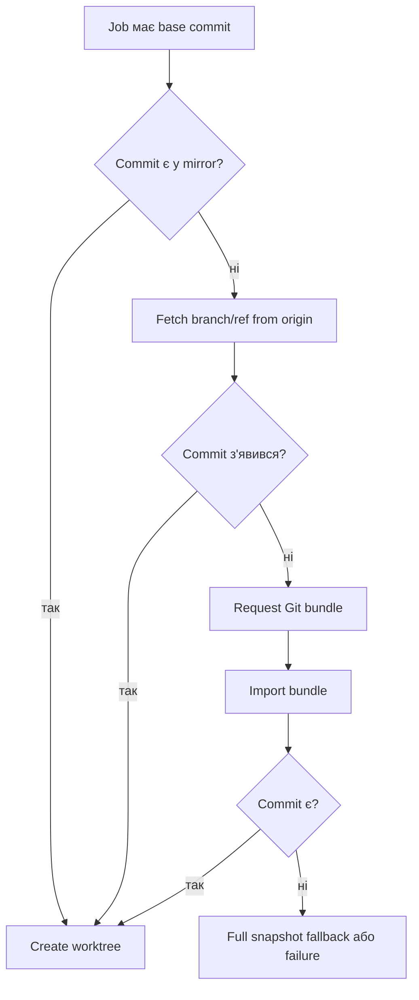
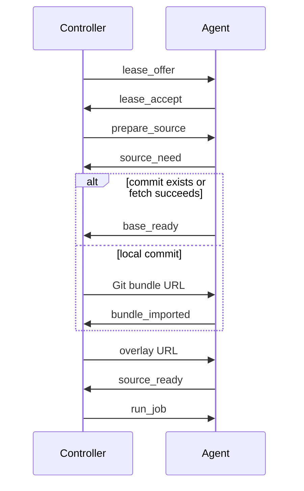
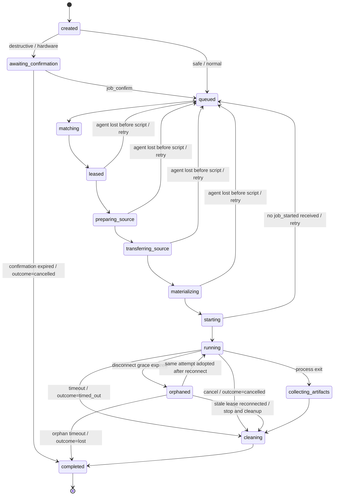

# Remote Build Orchestrator з MCP та кросплатформними worker-агентами

**Статус:** Technical Design / Implementation Specification  
**Версія:** 1.0  
**Дата:** 2026-07-19  
**Робоча назва:** Remote Build Orchestrator (**RBO**)

---

## 0. Затверджені рішення та правила реалізації

Цей розділ є нормативним. Якщо інші приклади в документі суперечать йому,
реалізація повинна слідувати цьому розділу, а приклад потрібно виправити.

У документі слова **MUST**, **SHOULD** і **MAY** мають значення обов'язкової
вимоги, рекомендованої поведінки та необов'язкового розширення відповідно.

### 0.1. Затверджені продуктові рішення

1. У MVP існує один Controller на головному development PC.
2. Fusion, Codex, Claude, Cursor та Antigravity у MVP працюють на тому самому
   PC, що й Controller. Worker Agents працюють на інших машинах.
3. MCP надається одночасно через:
   - Streamable HTTP на loopback interface;
   - локальний stdio adapter, який проксіює виклики в Controller.
4. `safe` і `normal` jobs запускаються без підтвердження.
   `destructive` і `hardware` jobs потребують explicit confirmation та
   сумісного Agent label.
5. Agent публікує named toolchain profiles. Scheduler вибирає конкретний
   profile ID, а executor активує саме його environment.
6. При втраті зв'язку звичайний build/test продовжується. `destructive` і
   `hardware` job самозупиняється після закінчення lease/disconnect timeout.
7. Snapshot використовує cooperative lock: AI client не змінює workspace,
   доки `job_submit` створює immutable snapshot. Після повернення `job_submit`
   редагування дозволене, а execution продовжується асинхронно.
8. Artifacts зберігаються Controller і можуть explicit-но materialize-итися у
   дозволений локальний path через MCP tool.
9. Repository cache реалізується рано; базові `ccache`/`sccache` та package
   caches входять у MVP після correctness repository cache.
10. Controller і Agent пишуться на TypeScript/Node.js. Windows process
    containment реалізує невеликий Rust helper із Windows Job Object.
11. Agent встановлюється як Windows Service, launchd service або systemd
    service та підтримує `install`, `status`, `start`, `stop`, `uninstall`.
12. Security bootstrap: pinned Controller certificate, Agent device key pair,
    pairing code, credential rotation і revocation.
13. У MVP Agent належить одному Controller. Federation і multi-controller
    execution не підтримуються.

### 0.2. Незмінні інваріанти

- Controller MUST не змінювати source workspace, Git `HEAD`, branch або index.
- Один job MUST виконувати рівно один immutable snapshot.
- Усі execution-scoped files і database records MUST бути прив'язані до
  `attempt_id`; network commands додатково прив'язані до `lease_id` та
  `lease_epoch`.
- Agent MUST не запускати script до повної materialization і hash verification.
- Remote HTTP data plane MUST бути доступним Agent і не повинен відкривати MCP
  endpoint у LAN.
- Мінімальні security controls із §29 MUST бути реалізовані до першого remote
  execution, а не окремою пізньою фазою.
- Кожна implementation phase MUST завершуватися зазначеними тестами та exit
  criteria до початку наступної.

### 0.3. Свідоме обмеження MVP

Remote development workspace не підтримується: якщо AI coding client працює на
іншому PC, він не може передати свій локальний `project_root` цьому Controller.
Майбутнє розширення для цього сценарію — окремий Client Gateway/Snapshotter.

---

## 1. Призначення

RBO — локальна система розподіленого виконання build, test, QEMU, Docker та діагностичних сценаріїв для інтерактивної AI-розробки.

Основний workflow:

```text
Fusion / Codex / Claude / Cursor / Antigravity змінює локальні файли
→ через MCP submit-ить job
→ Controller формує snapshot поточного dirty workspace
→ Scheduler вибирає найкращого вільного агента
→ Agent бере cached Git repository
→ checkout-ить base commit
→ накладає змінені, нові, видалені й додаткові файли
→ запускає build/test/script
→ стримить логи
→ повертає exit status та artifacts
```

Система оптимізована не для committed CI-коду, а для локального working tree, який може містити:

- staged зміни;
- unstaged зміни;
- нові untracked-файли;
- видалені файли;
- локальні commit, яких ще немає у remote;
- додаткові папки або інші проєкти;
- scripts для QEMU, Docker, логування або hardware tests.

Buildkite, GitHub Actions чи іншу CI-систему доцільно залишити для pull requests, release builds та committed code.

---

## 2. Ключові вимоги

Система повинна:

1. Надавати однакові MCP tools для Fusion, Codex, Claude, Cursor та Antigravity.
2. Автоматично знаходити та реєструвати worker agents.
3. Визначати OS, architecture, toolchains, Docker, QEMU, ESP-IDF, CPU, RAM, disk та custom capabilities.
4. Автоматично вибирати сумісного агента.
5. Підтримувати cache Git repositories на кожному agent.
6. Передавати branch, base commit та dirty overlay.
7. Працювати з commit, який:
   - є у remote;
   - є лише локально.
8. Передавати modified, untracked, deleted та explicit additional files.
9. Запускати довготривалі scripts.
10. Стримити stdout/stderr без накопичення всього output у RAM.
11. Підтримувати timeout, cancel і process-tree cleanup.
12. Підтримувати QEMU, Docker, Docker Compose та фонові процеси.
13. Збирати logs і artifacts.
14. Відновлювати log streaming після network reconnect.
15. Виконувати локальний fallback, коли remote agents зайняті або offline.
16. Не змінювати локальні `HEAD`, branch або staging area.

---

## 3. Нецілі першої версії

Перша версія не повинна бути повним аналогом Jenkins або Buildkite.

Необов'язкові для MVP функції:

- web dashboard;
- approval workflows;
- release management;
- Kubernetes execution;
- multi-tenant untrusted workloads;
- складна RBAC;
- DAG pipelines;
- distributed content-addressed filesystem;
- інтерактивний terminal/PTY;
- автоматичне кешування всіх build outputs;
- federation кількох Controller instances.
- AI coding clients із workspace на іншому development PC (потребує майбутнього
  Client Gateway/Snapshotter).

---

## 4. Архітектура



### 4.1. Controller

Controller запускається на головній development machine під користувачем розробника.

Відповідальність:

- MCP endpoint;
- agent registry;
- scheduler;
- snapshot creation;
- job queue;
- source transfer;
- log persistence;
- artifact storage;
- local fallback;
- pairing та authentication;
- cleanup і retention;
- CLI та діагностика.

### 4.2. Agent

Agent — lightweight daemon на macOS, Windows або Linux.

Відповідальність:

- реєстрація в Controller;
- capability probes;
- heartbeat;
- repository cache;
- source materialization;
- process execution;
- timeout/cancel;
- process-tree cleanup;
- log spool;
- artifact collection;
- cache cleanup.

### 4.3. MCP Adapter

MCP Adapter повинен бути тонким.

Він:

- валідує input;
- перевіряє allowed paths;
- submit-ить job;
- повертає job ID;
- не містить scheduler logic;
- не передає source bytes через LLM context;
- не тримає довгий tool call відкритим годинами.

MVP має два transport adapters з одним shared tool registry і тими самими Zod
schemas:

1. Streamable HTTP endpoint усередині Controller на loopback interface.
2. `rbo mcp-stdio` — локальний stdio process без власної database або scheduler;
   він проксіює requests у loopback Controller API.

`job_submit` є винятком із повністю async поведінки: tool call залишається
відкритим лише до завершення immutable snapshot. Після відповіді job виконується
асинхронно через `job_wait`/`job_logs`. Snapshot capture має configurable timeout
і повертає `workspace_changed`, якщо cooperative lock було порушено.

---

## 5. Основні архітектурні рішення

### ADR-001: AI coding client викликає один orchestration tool

AI coding client не повинен вручну:

- опитувати агентів;
- вибирати машину;
- будувати snapshot;
- завантажувати файли;
- вирішувати, чи запускати локально.

Client викликає `job_submit`, а Controller робить все детерміновано.

### ADR-002: Git base + exact overlay

Dirty workspace передається як:

```text
base commit
+
modified/new files
+
deleted paths
+
additional roots
```

Це краще, ніж temporary remote branch, тому що:

- не забруднює Git remote;
- не змінює local history;
- передає binary files byte-for-byte;
- легко включає additional folders;
- не залежить від patch quoting;
- дозволяє agent cache repository.

### ADR-003: Bare mirror cache на agent

Кожен agent тримає bare mirror repository.

```text
repo cache
→ fetch потрібного commit
→ isolated worktree
→ apply overlay
→ execute job
→ remove worktree
```

### ADR-004: Async MCP jobs

Довготривалі jobs працюють асинхронно:

```text
job_submit → job_id
job_wait → current/terminal state
job_logs → incremental logs
job_cancel → cancellation
job_artifacts → files
```

### ADR-005: Control plane і data plane розділені

- WebSocket: registration, heartbeat, lease, job status, logs, cancel.
- HTTP: snapshot, Git bundle, artifact upload/download.

### ADR-006: Agent відкриває outbound connection

Agent сам підключається до Controller.

Це спрощує:

- firewall;
- NAT;
- Tailscale/VPN;
- agent discovery;
- reconnect;
- security model.

### ADR-007: Script є головною execution abstraction

QEMU, Docker та log collection запускаються як scripts із керованим lifecycle.

Спеціальні QEMU/Docker job types можуть з'явитися пізніше як wrappers.

---

## 6. Технологічний стек

Рекомендований стек:

```text
Language: TypeScript
Runtime: Node.js
Controller storage: SQLite + filesystem
MCP: official TypeScript SDK
Agent transport: WebSocket
Data transfer: authenticated HTTP
Archive: tar + zstd
Configuration: YAML
Schemas: Zod
IDs: ULID із type prefix (`job_`, `att_`, `agt_`, `snp_`, `art_`)
Hashing: SHA-256
Discovery: explicit URL, потім mDNS/DNS-SD
Remote network: LAN або Tailscale
```

### 6.1. Чому TypeScript/Node.js

Переваги:

- офіційний MCP SDK;
- простий WebSocket/HTTP stack;
- кросплатформність;
- хороша робота з child processes;
- спільні schemas для Controller та Agent;
- легко зробити CLI;
- швидка розробка MVP.

### 6.2. Monorepo

```text
rbo/
  package.json
  pnpm-workspace.yaml
  tsconfig.base.json

  apps/
    controller/
      src/
        main.ts
        config.ts
        mcp/
        http/
        websocket/
        scheduler/
        agents/
        snapshots/
        jobs/
        storage/
        security/

    agent/
      src/
        main.ts
        config.ts
        connection/
        capabilities/
        repo-cache/
        source/
        executor/
        logs/
        artifacts/
        platform/
          unix/
          windows/

    cli/
      src/
        commands/
          agents.ts
          submit.ts
          status.ts
          logs.ts
          cancel.ts
          doctor.ts

    mcp-stdio/
      src/
        main.ts

  native/
    windows-executor/
      Cargo.toml
      src/
        main.rs

  packaging/
    windows/
    macos/
    linux/

  packages/
    protocol/
      src/
        schemas.ts
        messages.ts
        versions.ts

    snapshot/
      src/
        git-status.ts
        manifest.ts
        overlay-builder.ts
        archive.ts
        secret-policy.ts

    shared/
      src/
        errors.ts
        paths.ts
        hashing.ts
        ids.ts
        logging.ts

    testing/
      src/
        fake-agent.ts
        fixtures.ts
```

---

## 7. Deployment topology

### 7.1. Controller endpoints

```text
http://127.0.0.1:7410/mcp                 # Streamable HTTP MCP
http://127.0.0.1:7410/internal/v1/         # stdio adapter / local CLI only
https://<controller-host>:7411/data/v1/    # snapshots, bundles, artifacts
wss://<controller-host>:7411/agent         # Agent control plane
```

Port `7410` MUST bind лише на loopback. Port `7411` MUST використовувати TLS і
бути доступним paired Agents у LAN/Tailscale/VPN. `/data/v1` приймає лише
short-lived attempt-scoped tokens і не надає MCP або administrative operations.

Для MCP clients без Streamable HTTP запускається:

```text
rbo mcp-stdio --controller http://127.0.0.1:7410
```

Agent control і data endpoints доступні:

- у LAN;
- через Tailscale;
- через інший trusted VPN.

### 7.2. Discovery

#### MVP

Agent config містить explicit Controller URL:

```yaml
controller:
  urls:
    - wss://kpc:7411/agent
```

#### Наступна фаза

Controller рекламує:

```text
_rbo-controller._tcp.local
```

Через mDNS/DNS-SD.

TXT records:

```text
version=1
tls=1
pairing=required
controller_id=<uuid>
```

mDNS використовується лише для discovery. Authentication все одно обов'язкова.

---

## 8. Agent identity та pairing

### 8.1. Перший запуск

1. Користувач отримує fingerprint Controller certificate локально на Controller.
2. Agent знаходить Controller або отримує explicit URL і expected fingerprint.
3. Agent перевіряє TLS certificate fingerprint до відправлення pairing request.
4. Agent генерує device Ed25519 key pair.
5. Agent надсилає public key, device metadata і pairing request.
6. Controller показує one-time code, прив'язаний до Controller fingerprint та
   Agent public key.
7. Користувач звіряє code/fingerprint і підтверджує pairing.
8. Controller видає stable agent ID і signed Agent credential.
9. Agent зберігає private key та credential у OS-protected state directory, а
   не в disposable cache directory.

Credential має expiry, rotation і Controller-side revocation. Re-pairing
потрібний після зміни pinned Controller identity. У MVP використовується один
конкретний signed-token mechanism; альтернативний mTLS client certificate не
реалізується паралельно.

Concrete MVP mechanism:

- device і Controller signing keys: Ed25519;
- Agent credential: Controller-signed JWT із `alg=EdDSA`, `sub=agent_id`,
  `aud=controller_id`, device public-key thumbprint, `iat`, `exp` і
  `credential_version`;
- WebSocket authentication: Controller надсилає nonce, Agent повертає credential
  і Ed25519 signature nonce своїм device key;
- Controller перевіряє JWT signature/expiry/revocation та proof-of-possession;
- data-plane job tokens також є Controller-signed EdDSA JWT, але короткоживучі й
  містять scopes із §12.3;
- private keys ніколи не передаються і не логуються.

### 8.2. Agent identity

Не використовувати hostname як primary ID.

```json
{
  "agent_id": "agt_01J...",
  "display_name": "mac-mini-build",
  "hostname": "smartyniuk-mac.local"
}
```

---

## 9. Capabilities

### 9.1. Capability report

```json
{
  "agent_id": "agt_01J...",
  "os": {
    "family": "macos",
    "version": "15.5",
    "arch": "arm64"
  },
  "resources": {
    "cpu_logical": 10,
    "memory_total_mb": 16384,
    "memory_free_mb": 9300,
    "disk_free_mb": 184000
  },
  "execution": {
    "max_jobs": 1,
    "shells": ["bash", "zsh"],
    "supports_tty": true,
    "supports_process_tree_kill": true
  },
  "tools": {
    "git": ["2.50.1"],
    "node": ["24.11.1"],
    "python": ["3.12.8"],
    "docker": ["28.1.1"],
    "qemu-system-xtensa": ["9.2.2"],
    "esp-idf": ["5.5.1", "6.0.2"]
  },
  "toolchain_profiles": [
    {
      "id": "esp-idf-6.0.2",
      "kind": "esp-idf",
      "version": "6.0.2",
      "platform": "macos-arm64",
      "activation": {
        "type": "source_script",
        "path": "/opt/esp/idf-6.0.2/export.sh"
      },
      "environment_fingerprint": "sha256:..."
    }
  ],
  "labels": {
    "role": "remote-build",
    "hardware.usb_esp32s3": "false"
  },
  "secret_refs": ["github-readonly"]
}
```

### 9.1.1. Named toolchain profiles

`tools` є коротким summary для UI і diagnostics. Execution MUST використовувати
конкретний entry з `toolchain_profiles`.

Scheduler:

1. match-ить semantic requirement, наприклад `esp-idf >=6.0.0 <6.1.0`;
2. вибирає один concrete profile;
3. записує profile ID і fingerprint в attempt;
4. включає selection у lease/run command.

Agent executor активує environment profile перед user script. Bare command на
кшталт `idf.py build` після activation MUST resolve-итися до executable саме
вибраного profile. Якщо fingerprint або executable змінився після scheduling,
Agent відхиляє lease з `toolchain_changed` і Controller виконує rematch.

### 9.2. Джерела capabilities

Capabilities складаються з:

- automatic probes;
- static config;
- user overrides;
- custom probe scripts.

### 9.3. Probe example

```yaml
probes:
  - id: esp-idf-6.0.2
    command: /opt/esp/idf-v6.0.2/tools/idf.py --version
    parser: regex
    regex: 'ESP-IDF v(?<version>.+)'
```

### 9.4. Refresh

- full probe при startup;
- lightweight heartbeat кожні 5–15 секунд;
- full refresh періодично;
- manual `agent_probe`.

### 9.5. Hard requirements

```json
{
  "requirements": {
    "os": ["macos", "linux"],
    "arch": ["arm64", "x64"],
    "tools": {
      "esp-idf": ">=6.0.0 <6.1.0",
      "qemu-system-xtensa": "*"
    },
    "labels": {
      "hardware.usb_esp32s3": "true"
    },
    "min_memory_mb": 4096,
    "min_disk_mb": 20000
  }
}
```

### 9.6. Soft preferences

```json
{
  "preferences": {
    "agent_ids": ["agt_mac"],
    "os_order": ["macos", "windows"],
    "prefer_repo_cache": true,
    "prefer_low_load": true
  }
}
```

---

## 10. Repository cache

### 10.1. Agent cache layout

```text
agent-data/
  repos/
    <repo-key>/
      mirror.git/
      metadata.json
      fetch.lock

  workspaces/
    <attempt-id>/
      project/
      additional/
      logs/
      artifacts/
      .rbo/

  logs/<attempt-id>/
  blobs/
  artifacts/<attempt-id>/
```

### 10.2. Canonical repository identity

SSH та HTTPS URLs одного repository повинні давати той самий key.

```text
git@github.com:kuzyasun/esp32-boilerplate.git
https://github.com/kuzyasun/esp32-boilerplate.git
```

Нормалізуються до:

```text
github.com/kuzyasun/esp32-boilerplate
```

`repo_key`:

```text
sha256(canonical_repository_id)
```

### 10.3. Mirror initialization

```bash
git clone --mirror <repo-url> <mirror.git>
```

### 10.4. Доступ до repository у MVP

Передумова MVP: кожен Agent, що може виконувати job для private repository,
вже має локально налаштований **read-only** доступ до цього repository у GitHub
(наприклад, deploy key, Git credential manager або service account). Controller
передає лише canonical repository URL, ref та commit і ніколи не передає свої
developer credentials через MCP, WebSocket або snapshot.

Controller derives repository URL з approved local Git root, але MUST застосувати
configured allowlist для Git schemes, hosts і optional repository prefixes.
Agent повторно перевіряє allowlist перед clone/fetch. `file://`, local paths,
Git external remote helpers і невідомі SSH hosts заборонені в MVP.

Якщо Agent не може clone/fetch repository, job завершується помилкою
`repo_fetch`; підбір іншого сумісного Agent дозволений. Передавання Git bundle
для local-only commit реалізується у Phase 5.

### 10.5. Commit acquisition



### 10.6. Targeted fetch

Controller передає:

```json
{
  "repo": {
    "url": "git@github.com:kuzyasun/esp32-boilerplate.git",
    "canonical_id": "github.com/kuzyasun/esp32-boilerplate",
    "branch": "master",
    "base_commit": "54ec0b...",
    "fetch_refs": ["refs/heads/master"]
  }
}
```

Agent:

```bash
git --git-dir=<mirror> fetch --no-tags origin   refs/heads/master:refs/remotes/origin/master
```

### 10.7. Local unpushed commits

Якщо base commit є лише локально:

1. Agent повідомляє `base_commit_missing`.
2. Controller створює Git bundle.
3. Agent завантажує bundle.
4. Імпортує objects у mirror.
5. Створює worktree.

Fallback order:

```text
remote fetch
→ Git bundle
→ full source snapshot
```

### 10.8. Worktree creation

```bash
git --git-dir=<mirror.git> worktree add   --detach   <workspace>/project   <base-commit>
```

Cleanup:

```bash
git --git-dir=<mirror.git> worktree remove --force <workspace>/project
git --git-dir=<mirror.git> worktree prune
```

### 10.9. Concurrency

- Fetch/import захищений per-repo mutex.
- Кожний job має окремий worktree.
- Один mirror може мати кілька worktrees.
- Cache cleanup не видаляє repo з active worktrees.

### 10.10. Cache eviction

```yaml
repo_cache:
  max_size_gb: 100
  min_free_disk_gb: 30
  retention_days: 30
```

Eviction policy:

1. Не чіпати active repos.
2. LRU за `last_used_at`.
3. Видаляти до досягнення `min_free_disk_gb`.
4. Логувати всі eviction events.

---

## 11. Source snapshot model

### 11.1. Модель

```text
cached base commit
+
exact overlay files
+
deleted paths
+
additional roots
=
точний workspace job
```

### 11.2. Working tree semantics

Snapshot передає фактичний filesystem state.

- staged зміни включаються;
- unstaged зміни включаються;
- staged + unstaged одного файла передають останній стан файла;
- deleted files передаються як deletion list;
- untracked non-ignored включаються;
- ignored files не включаються автоматично.

Порожні untracked directories, якщо вони потрібні job, передаються як explicit
empty-directory markers у manifest. Якщо marker не підтримує цільова платформа,
job має завершитися до запуску з `materialization`, а не тихо змінити tree.

Для base checkout Agent використовує контрольований Git config (зокрема
`core.autocrlf=false`, вимкнені hooks і передбачувані filters). LFS та submodules
обробляються лише за задекларованою policy. Це не дає global Git config різних
machines змінити materialized tree.

### 11.2.1. Cooperative snapshot lock

MCP client MUST припинити source edits перед `job_submit` і не відновлювати їх,
доки tool не поверне `snapshot_captured` або error. Lock є protocol convention,
а не OS filesystem lock; сторонній editor або process все одно може записати
файл.

Controller тому MUST перевіряти стабільність самостійно:

1. Зафіксувати `HEAD`, Git status та file identity tuple для всіх overlay і
   additional-root entries: normalized path, type, size, mtime та platform file ID
   де він доступний.
2. Прочитати кожний файл один раз у temporary content storage, одночасно
   обчислюючи SHA-256. Manifest і archive будуються з цих captured bytes, а не
   повторним читанням живого workspace.
3. Повторно перевірити `HEAD`, Git status і file identity tuples.
4. Якщо змінився `HEAD`, набір paths, type, size, mtime або file ID — видалити
   partial snapshot і повернути structured error `workspace_changed`.
5. Лише після успішної перевірки atomic-но опублікувати snapshot і повернути
   `job_id`, `snapshot_id`, `content_id`, `snapshot_captured=true`.

Автоматичний retry усередині Controller не виконується: AI client отримує error,
знову припиняє edits і повторює `job_submit` із новим `client_request_id`.
Ідемпотентний повтор того самого network request із тим самим ID повертає
попередній результат і не створює інший snapshot.

Якщо MCP connection/tool call обірвався до response, client спочатку повторює
той самий request із тим самим `client_request_id`, щоб дізнатися результат.
Controller persist-ить idempotency state `capturing | captured | failed`. Якщо
client уже відновив edits, final validation або збереже вже завершений immutable
snapshot, або детерміновано завершить capture з `workspace_changed`; mixed
snapshot не публікується.

### 11.3. Виявлення змін

Основна команда:

```bash
git status --porcelain=v2 -z --untracked-files=all
```

Додатково:

```bash
git diff --name-status -z HEAD
git ls-files --others --exclude-standard -z
git ls-files --stage -z
```

NUL-separated format потрібен для filenames із пробілами, Unicode, tabs або newlines.

### 11.4. Manifest

```json
{
  "schema_version": 1,
  "content_id": "sha256:...",
  "repo": {
    "canonical_id": "github.com/kuzyasun/esp32-boilerplate",
    "url": "git@github.com:kuzyasun/esp32-boilerplate.git",
    "branch": "master",
    "base_commit": "54ec0b915decc6bab3efc94cb7184d3f44e16736",
    "head_is_pushed": false
  },
  "workspace": {
    "main_mount": "project",
    "cwd": "project"
  },
  "overlay": {
    "files": [
      {
        "path": "main/app_main.c",
        "type": "file",
        "mode": "100644",
        "size": 12890,
        "sha256": "..."
      },
      {
        "path": "scripts/run_qemu.sh",
        "type": "file",
        "mode": "100755",
        "size": 1024,
        "sha256": "..."
      }
    ],
    "deletions": [
      "main/obsolete.c"
    ]
  },
  "additional_roots": [
    {
      "id": "dtracker-shared",
      "mount": "additional/dtracker-shared",
      "file_count": 42,
      "total_size": 123456,
      "tree_sha256": "..."
    }
  ],
  "payload": {
    "mode": "git_overlay",
    "format": "tar",
    "compression": "zstd",
    "sha256": "...",
    "size": 345678
  }
}
```

### 11.5. Чому exact overlay, а не лише Git patch

`git diff --binary` можна використовувати як diagnostic artifact, але exact overlay простіший для:

- binary files;
- untracked files;
- symlinks;
- Windows paths;
- additional roots;
- byte-for-byte verification;
- delete/rename handling.

### 11.6. File types

Підтримати:

- regular file;
- executable file;
- symlink;
- explicit empty directory marker.

Не підтримувати в MVP:

- sockets;
- named pipes;
- device files;
- ACL replication;
- extended attributes.

### 11.7. Modes

Git-like modes:

```text
100644 regular file
100755 executable
120000 symlink
```

### 11.8. Symlink policy

- absolute symlink заборонений;
- symlink не може виходити за workspace;
- target зберігається як text payload;
- target agent повинен мати capability для symlink;
- Windows без symlink support — fail з `symlink_unsupported`; copy fallback не
  входить у MVP, бо змінює filesystem semantics.

### 11.9. Deleted paths

Agent:

1. checkout-ить base commit;
2. видаляє `deletions`;
3. overlay-ить files;
4. застосовує modes;
5. перевіряє hashes.

Path constraints:

- тільки relative;
- separator `/`;
- без `..`;
- без absolute paths;
- без drive letters;
- без UNC paths.

### 11.10. Untracked files

Включаються через:

```bash
git ls-files --others --exclude-standard
```

### 11.11. Explicit ignored files

```json
{
  "source_policy": {
    "include_ignored": [
      "sdkconfig",
      "certs/test-ca.pem"
    ]
  }
}
```

Кожний path:

- explicit;
- логуються path і hash;
- проходить secret policy;
- wildcard `**/*` заборонений без admin policy.

### 11.12. Secret denylist

Default:

```text
.env
.env.*
*.pem
*.key
*.p12
*.pfx
id_rsa
id_ed25519
credentials.json
secrets.*
.aws/
.ssh/
```

Modes:

```text
block
warn
allow
```

Default — `block`.

Policy застосовується до кожного byte payload, який Controller передає Agent:
full-snapshot files, overlay files, explicit ignored files, local LFS blobs та
additional roots. Для cached base commit Agent отримує files із вже approved Git
repository за власними read-only credentials; denylist не є заміною repository
access policy або secret scanning у Git history.

### 11.13. Additional roots

```json
{
  "additional_roots": [
    {
      "source_path": "C:/develop/DTracker/components/shared",
      "mount_path": "additional/dtracker-shared",
      "include": ["**/*"],
      "exclude": [".git/**", "build/**"],
      "mode": "read_only"
    }
  ]
}
```

Rules:

- local source path бачить лише Controller;
- agent бачить logical mount;
- mount path relative;
- roots не overlap;
- `.git` не включається;
- read-only mode застосовується де можливо;
- additional root передається filtered archive.

### 11.14. Submodules

MVP policy (Approach A — Hybrid overlay entries):

- `payload.mode=full`: initialized clean submodule content capture-иться як
  ordinary source files без його `.git` metadata; uninitialized/missing або dirty
  submodule завершує capture помилкою;
- `payload.mode=git_overlay`:
  - base submodules initialised via `git submodule update --init --recursive` з controlled config та approved Git host policy;
  - clean pointer changes: manifest `gitlink` entry (SHA pin); Agent checks out pin detached parent-before-child;
  - dirty submodules: hybrid overlay (pin SHA + packed dirty/untracked files under submodule path prefix);
  - uninitialized/missing submodule checkout on Controller host fails closed with actionable error (`git submodule update --init --recursive`).

### 11.15. Git LFS

Agent декларує `git-lfs`.

Policy:

- `payload.mode=full` capture-ить materialized working-tree bytes; якщо checkout
  містить лише LFS pointer замість required content, snapshot fail-иться з
  `lfs_content_missing`;
- `payload.mode=git_overlay`: clean base використовує `git lfs pull`;
- dirty LFS pointer overlay-иться;
- local LFS object, якого немає remote, передається explicit blob;
- при відсутності `git-lfs` job не match-иться.

### 11.16. Content ID і snapshot instance

`content_id` детермінований:

```text
sha256(canonical content manifest + ordered file hashes)
```

У canonical content manifest не входять `created_at`, hostname, випадковий ID,
job ID та інші runtime-поля. `snapshot_id` — окремий ULID конкретного створення
snapshot і може містити runtime metadata поза canonical manifest.

Це дозволяє:

- dedup;
- повторний запуск;
- audit;
- source verification.

---

## 12. Snapshot transfer

### 12.1. MVP payload

```text
snapshot.json
full-source.tar.zst  # Phase 3-4 payload mode=full
overlay.tar.zst      # Phase 5+ payload mode=git_overlay
base.bundle.zst      # optional local-only commit, Phase 5+
```

Snapshot manifest MUST містити рівно один `payload_mode`:

- `full`: archive містить усі tracked working-tree files у їх captured state,
  untracked non-ignored files, explicit ignored files та additional roots;
- `git_overlay`: Agent materialize-ить base commit і накладає overlay/deletions.

Shared manifest schema є discriminated union за `payload.mode`:

- `full` MUST мати `source.files` і MUST NOT вимагати `repo.base_commit` або
  `overlay`;
- `git_overlay` MUST мати `repo.base_commit`, `overlay.files` і
  `overlay.deletions`; `source` відсутній;
- `base.bundle` дозволений лише для `git_overlay`.

`.git` directory, sockets/devices, implicit ignored build outputs і paths,
заблоковані source/secret policy, ніколи не входять у full archive. Agent для
`full` створює новий empty attempt workspace і не потребує repository access.

### 12.2. Flow



### 12.3. HTTP requirements

- short-lived job token;
- token scope: `agent_id`, `job_id`, `attempt_id`, `lease_id` і operation;
- кожна команда та HTTP request містять актуальний lease epoch; Controller
  відхиляє застарілі lease після reconnect або retry;
- SHA-256;
- expected size;
- range requests бажані;
- temporary file;
- atomic rename;
- cleanup partial downloads;
- download limits.

### 12.4. Future optimization

Після MVP:

```text
manifest file hashes
→ agent повідомляє missing blobs
→ controller передає лише відсутні
```

---

## 13. Job model

### 13.1. Job request

Це **єдина canonical schema** для `job_submit`, CLI і persisted
`request_json`; її реалізують у спільному Zod package. Інші приклади в цьому
документі використовують ті самі вкладені поля, а не окремий flat contract.
Пара `(client_id, client_request_id)` робить повторний MCP submit ідемпотентним у
межах Controller: той самий client і key повертають вже створений job.
`client_id` походить із локальної MCP adapter configuration/session і не є полем,
яке LLM довільно передає в `JobRequest`.

```json
{
  "client_request_id": "req_01J...",
  "name": "ESP-IDF QEMU integration tests",
  "source": {
    "project_root": "C:/develop/esp32-boilerplate",
    "cwd": ".",
    "additional_roots": []
  },
  "execution": {
    "shell": "bash",
    "script": "idf.py build\n./scripts/run-qemu-tests.sh",
    "timeout_seconds": 3600,
    "idle_timeout_seconds": 600,
    "cancel_grace_seconds": 10,
    "tty": false,
    "completion": { "type": "run_to_exit" }
  },
  "requirements": {
    "os": ["macos", "linux"],
    "tools": {
      "esp-idf": ">=6.0.0 <6.1.0",
      "qemu-system-xtensa": "*"
    }
  },
  "preferences": {
    "prefer_repo_cache": true,
    "allow_local_fallback": true
  },
  "queue_policy": "local_fallback",
  "risk_level": "normal",
  "intent": null,
  "source_policy": {
    "include_untracked": true,
    "include_ignored": [],
    "secret_policy": "block"
  },
  "artifacts": [
    { "glob": "build/*.bin", "required": true },
    { "glob": "logs/**/*.log", "required": false },
    { "glob": "reports/**/*.xml", "required": false }
  ]
}
```

### 13.2. Script-first execution

Не передавати складний raw command через кілька shell layers.

Controller створює script file:

```text
.rbo/job.sh
.rbo/job.ps1
.rbo/job.cmd
```

Agent запускає:

```bash
/bin/bash .rbo/job.sh
```

або:

```powershell
pwsh -NoProfile -NonInteractive -File .rbo/job.ps1
```

### 13.3. Shell IDs

```text
bash
zsh
sh
powershell
pwsh
cmd
direct
```

`direct` — executable + args без shell interpolation.

### 13.4. Environment variables

System:

```text
RBO_JOB_ID
RBO_ATTEMPT_ID
RBO_AGENT_ID
RBO_SNAPSHOT_ID
RBO_WORKSPACE
RBO_PROJECT_DIR
RBO_ARTIFACT_DIR
RBO_LOG_DIR
RBO_BASE_COMMIT
RBO_BRANCH
RBO_IS_DIRTY
RBO_TOOLCHAIN_PROFILES_JSON
```

User env:

```json
{
  "env": {
    "IDF_TARGET": "esp32",
    "CI": "1"
  }
}
```

Secrets не передаються plain text через MCP.

Замість цього:

```json
{
  "secret_refs": {
    "GITHUB_TOKEN": "github-readonly"
  }
}
```

Agent має local named secret store.

Agent capability report містить лише дозволені secret reference names, не
values. Scheduler hard-filter-ить Agent за всіма requested `secret_refs`. Secret
values інжектяться executor-ом після materialization, redact-яться на Agent до
network transmission де можливе exact-value redaction і ніколи не записуються у
manifest/request JSON.

---

## 14. Execution modes

### 14.1. `run_to_exit`

Job завершується при exit script.

```json
{
  "execution": {
    "completion": { "type": "run_to_exit" }
  }
}
```

### 14.2. `run_for_duration`

```json
{
  "execution": {
    "completion": {
      "type": "run_for_duration",
      "duration_seconds": 120
    }
  }
}
```

Agent:

- запускає script;
- збирає логи;
- після duration надсилає graceful stop;
- після grace — force kill;
- збирає artifacts.

### 14.3. `run_until_log_match`

```json
{
  "execution": {
    "completion": {
      "type": "run_until_log_match",
      "success_pattern": "ALL TESTS PASSED",
      "failure_pattern": "Guru Meditation Error",
      "max_duration_seconds": 300
    }
  }
}
```

### 14.4. `run_with_collector`

У майбутньому job може мати:

- main process;
- log collector;
- serial collector;
- Docker logs collector;
- file tail collector.

Для MVP це реалізується одним user script із background processes.

---

## 15. Long-running process model

Agent повинен:

- не накопичувати output у RAM;
- використовувати streaming child process API;
- вести local disk spool;
- стримити chunks;
- підтримувати reconnect;
- enforce timeout;
- kill descendants;
- виконувати cleanup script;
- збирати artifacts після failure/timeout/cancel.

### 15.1. Unix/macOS/Linux

- process group;
- session leader;
- cancel:
  1. SIGINT або SIGTERM;
  2. grace period;
  3. SIGKILL process group.

### 15.2. Windows

MVP MUST містити `rbo-executor-windows.exe`, невеликий Rust helper. Node.js Agent
передає helper-у validated executable, args, cwd, environment, timeout і
cancel-grace через versioned JSON protocol. Helper:

1. створює Windows Job Object із kill-on-close;
2. створює child process suspended;
3. додає process до Job Object до відновлення execution;
4. стримить stdout/stderr назад Agent;
5. виконує graceful cancellation, а потім terminates Job Object;
6. повертає structured exit result.

Fallback order:

1. Windows Job Object — основний варіант.
2. `taskkill /PID <pid> /T /F` — лише diagnostic/degraded fallback, який Agent
   MUST оголосити як `supports_process_tree_kill=false` для jobs, що вимагають
   strict containment.

Kill лише parent PID недостатній.

Rust helper є окремим versioned package у monorepo та повинен мати integration
test, де child створює grandchild, після cancel обидва процеси відсутні.

### 15.3. Cleanup hook

```json
{
  "execution": {
    "script": "...",
    "cleanup_script": "docker compose down --remove-orphans || true",
    "cleanup_timeout_seconds": 60
  }
}
```

Cleanup виконується після:

- success;
- failure;
- timeout;
- cancel;
- Agent-side execution error.

---

## 16. QEMU workflow

### 16.1. Простий QEMU script

```bash
#!/usr/bin/env bash
set -euo pipefail

mkdir -p "$RBO_LOG_DIR"

idf.py build

# RBO enforces max duration; do not rely on GNU `timeout` being installed.
./scripts/start-qemu.sh   2>&1 | tee "$RBO_LOG_DIR/qemu-console.log"

./scripts/validate-qemu-log.sh   "$RBO_LOG_DIR/qemu-console.log"
```

### 16.2. QEMU з фоновим процесом

```bash
#!/usr/bin/env bash
set -euo pipefail

LOG="$RBO_LOG_DIR/qemu.log"
mkdir -p "$(dirname "$LOG")"

cleanup() {
  if [[ -n "${QEMU_PID:-}" ]]; then
    kill "$QEMU_PID" 2>/dev/null || true
    wait "$QEMU_PID" 2>/dev/null || true
  fi
}
trap cleanup EXIT INT TERM

./scripts/qemu-start.sh >"$LOG" 2>&1 &
QEMU_PID=$!

timeout_at=$((SECONDS + 180))
passed=0

while (( SECONDS < timeout_at )); do
  tail -n 20 "$LOG" || true

  if grep -q "ALL TESTS PASSED" "$LOG"; then
    passed=1
    break
  fi

  if grep -q "Guru Meditation Error" "$LOG"; then
    break
  fi

  if ! kill -0 "$QEMU_PID" 2>/dev/null; then
    break
  fi

  sleep 1
done

cp "$LOG" "$RBO_ARTIFACT_DIR/qemu.log"

if (( passed == 0 )); then
  echo "QEMU tests did not pass"
  exit 1
fi
```

---

## 17. Docker workflow

### 17.1. Docker resource ownership

Agent inject-ить:

```text
RBO_JOB_ID
RBO_ATTEMPT_ID
```

Рекомендовано label-ити resources:

```bash
docker run \
  --label "rbo.job=$RBO_JOB_ID" \
  --label "rbo.attempt=$RBO_ATTEMPT_ID" \
  --name "rbo-$RBO_ATTEMPT_ID-app" ...
```

Cleanup:

```bash
docker ps -aq --filter "label=rbo.attempt=$RBO_ATTEMPT_ID" |
  while IFS= read -r container_id; do docker rm -f "$container_id"; done
```

### 17.2. Docker Compose example

```bash
#!/usr/bin/env bash
set -euo pipefail

export COMPOSE_PROJECT_NAME="rbo_$(printf '%s' "$RBO_ATTEMPT_ID" | tr '[:upper:]' '[:lower:]' | tr -cd 'a-z0-9_-')"

cleanup() {
  docker compose down -v --remove-orphans || true
}
trap cleanup EXIT INT TERM

docker compose up -d --build

docker compose logs -f   2>&1 | tee "$RBO_LOG_DIR/docker-compose.log" &
LOG_PID=$!

./scripts/wait-for-health.sh
./scripts/run-integration-tests.sh

kill "$LOG_PID" 2>/dev/null || true
wait "$LOG_PID" 2>/dev/null || true

cp "$RBO_LOG_DIR/docker-compose.log"   "$RBO_ARTIFACT_DIR/docker-compose.log"
```

---

## 18. Job lifecycle

### 18.1. States

`state` описує lifecycle, а `outcome` — незмінний результат execution. Cleanup
ніколи не змінює `timed_out` або `cancelled` на success/failure.

```text
created
awaiting_confirmation
queued
matching
leased
preparing_source
transferring_source
materializing
starting
running
orphaned
collecting_artifacts
cleaning
completed
```

```text
outcome = succeeded | failed | timed_out | cancelled | lost
```

### 18.2. State machine



Помилки source preparation та materialization переходять у `cleaning` з
`outcome=failed`. Retry створює новий execution attempt, а не перезаписує
попередній.

### 18.3. Terminal result

```json
{
  "job_id": "job_01J...",
  "attempt_id": "att_01J...",
  "state": "completed",
  "outcome": "failed",
  "agent_id": "agt_mac",
  "exit_code": 1,
  "signal": null,
  "duration_ms": 87123,
  "failure": {
    "category": "process_exit",
    "message": "Script exited with code 1"
  },
  "log_cursor_end": 92812,
  "artifacts": [
    {
      "name": "qemu.log",
      "size": 482991,
      "sha256": "..."
    }
  ]
}
```

---

## 19. Scheduler

### 19.1. Hard filtering

Agent має:

- бути connected;
- не бути paused/draining;
- мати free slot;
- відповідати OS/arch;
- мати required shell;
- мати required tool versions;
- мати required labels;
- мати достатньо RAM/disk;
- підтримувати source features, наприклад symlink.

### 19.2. Score

```text
score =
  configured_priority * 1000
+ preferred_agent_bonus
+ repository_cache_hit * 500
+ exact_toolchain_match * 200
+ preferred_os_bonus
- running_jobs * 300
- cpu_load * 100
- estimated_transfer_mb
- recent_failure_penalty
```

### 19.3. Priority example

```text
remote Mac:      20
remote Windows:  10
local executor: -100
```

### 19.4. Lease

```json
{
  "type": "lease_offer",
  "job_id": "job_01J...",
  "attempt_id": "att_01J...",
  "lease_id": "lease_01J...",
  "lease_epoch": 1,
  "expires_at": "2026-07-19T18:05:30Z",
  "summary": {
    "repo": "github.com/kuzyasun/esp32-boilerplate",
    "required_tools": [
      "esp-idf@6.0.2",
      "qemu-system-xtensa"
    ],
    "selected_toolchain_profiles": [
      {
        "id": "esp-idf-6.0.2",
        "environment_fingerprint": "sha256:..."
      }
    ],
    "estimated_overlay_bytes": 180234
  }
}
```

Agent atomic-ly резервує slot і відповідає accept/reject. `lease_id` +
`lease_epoch` є fencing token: Agent приймає `prepare_source`, `run_job` і
`cancel_job` лише для актуального lease, а Controller приймає logs/status/
artifacts лише від його Agent та attempt.

Running lease поновлюється heartbeat-ами Controller. Agent зберігає локально
`attempt_id`, risk level, lease deadline і останній accepted epoch. Після
deadline:

- `safe`/`normal`: process може продовжуватися до configured orphan timeout,
  але attempt переходить у local `orphaned` і не запускає нових side effects;
- `destructive`/`hardware`: Agent сам завершує process tree, cleanup-ить
  resources і зберігає terminal result для replay після reconnect.

Застарілий epoch ніколи не може materialize-ити artifacts у Controller як
результат новішої attempt.

### 19.5. Queue policies

```text
wait
local_fallback
fail_fast
```

Default для інтерактивної роботи:

```text
wait
```

`local_fallback` — explicit opt-in. Він materialize-ить уже створений snapshot
у local isolated workspace; не запускає script у живому project root. Для
`destructive` і `hardware` jobs fallback заборонений за замовчуванням і потребує
окремого explicit policy.

### 19.6. Retry

Auto-retry дозволений лише якщо:

- user script ще не стартував; або
- explicit `retry_on_agent_loss=true`.

Не повторювати side-effecting job автоматично без explicit policy.

---

## 20. Controller ↔ Agent protocol

### 20.1. Transport

- Persistent WebSocket.
- JSON control messages.
- HTTP для source/artifacts.

### 20.2. Envelope

```json
{
  "protocol": 1,
  "type": "heartbeat",
  "message_id": "msg_01J...",
  "sent_at": "2026-07-19T18:00:00Z",
  "attempt_id": null,
  "lease_id": null,
  "lease_epoch": null,
  "payload": {}
}
```

Повідомлення, пов'язані з job, обов'язково містять усі три lease-поля. `hello`
і `heartbeat` без active job мають їх як `null`.

### 20.3. Agent → Controller

```text
hello
pairing_request
capabilities
heartbeat
lease_accept
lease_reject
source_need
source_ready
job_started
log_chunk
job_exit
artifact_manifest
cleanup_complete
agent_error
```

### 20.4. Controller → Agent

```text
hello_ack
pairing_challenge
lease_offer
prepare_source
snapshot_download
bundle_download
run_job
cancel_job
pause
resume
refresh_capabilities
shutdown
```

### 20.5. Heartbeat

```json
{
  "type": "heartbeat",
  "payload": {
    "state": "idle",
    "active_jobs": [],
    "cpu_load": 0.22,
    "memory_free_mb": 9300,
    "disk_free_mb": 184000
  }
}
```

### 20.6. Connection loss

Agent:

- не зупиняє `safe`/`normal` running job протягом disconnect grace;
- зупиняє `destructive`/`hardware` job після закінчення його lease/disconnect
  timeout, навіть якщо Controller недоступний;
- продовжує local log spool;
- reconnect-иться;
- повідомляє active jobs;
- відновлює transfer з acknowledged sequence.

Controller:

- використовує disconnect grace;
- не запускає duplicate відразу;
- після grace позначає attempt як `orphaned`, але не змішує її дані з іншою
  attempt;
- після reconnect або adopt-ить ту саму attempt, якщо replacement не стартував,
  або наказує Agent зупинити stale process tree і виконати cleanup;
- переводить attempt у `lost` лише після reconciliation/orphan timeout;
- не повторює side-effecting job без policy.

---

## 21. Log transport

### 21.1. Chunk

```json
{
  "type": "log_chunk",
  "payload": {
    "job_id": "job_01J...",
    "attempt_id": "att_01J...",
    "sequence": 184,
    "stream": "stdout",
    "timestamp": "2026-07-19T18:02:01.123Z",
    "encoding": "utf8",
    "data": "I (1234) app: started\n"
  }
}
```

Binary output:

```json
{
  "encoding": "base64",
  "data": "AAECAwQ="
}
```

### 21.2. Chunking

Рекомендовано:

- 8–32 KiB;
- flush кожні 100–250 ms;
- flush на newline де можливо;
- не чекати newline безкінечно.

### 21.3. Agent spool

```text
agent-data/logs/<attempt-id>/
  stdout.log
  stderr.log
  events.jsonl
  ack.json
```

### 21.4. Ack

```json
{
  "type": "log_ack",
  "payload": {
    "job_id": "job_01J...",
    "attempt_id": "att_01J...",
    "sequence": 184
  }
}
```

### 21.5. Backpressure

Якщо Controller повільний:

- logs пишуться на disk;
- network queue має limit;
- job не блокується;
- live logs можуть відставати;
- output не губиться до retention/spool limit.

### 21.6. Controller log API

```json
{
  "job_id": "job_01J...",
  "attempt_id": "att_01J...",
  "cursor": 92812,
  "next_cursor": 95331,
  "complete": false,
  "chunks": [
    {
      "stream": "stdout",
      "text": "..."
    }
  ]
}
```

---

## 22. Artifacts

### 22.1. Declaration

```json
{
  "artifacts": [
    {
      "glob": "build/*.bin",
      "required": true
    },
    {
      "glob": "logs/**/*.log",
      "required": false
    },
    {
      "glob": "reports/**/*.xml",
      "required": false
    }
  ]
}
```

### 22.2. Collection rules

- glob relative to workspace;
- max file count;
- max total size;
- SHA-256;
- directories archive-яться;
- symlink artifacts заборонені в MVP;
- artifacts збираються навіть після failure, якщо workspace існує.

### 22.3. Upload

1. Agent scan-ить globs.
2. Створює manifest.
3. Отримує upload URLs.
4. PUT files.
5. Controller перевіряє hash.
6. Agent надсилає completion.

### 22.4. MCP access

`job_artifacts` повертає metadata і download resource handles, а не binary bytes у tool response.

---

## 23. MCP tools

### 23.1. `agents_list`

```json
{
  "include_offline": false
}
```

Result:

```json
{
  "agents": [
    {
      "id": "agt_mac",
      "name": "mac-mini-build",
      "state": "idle",
      "os": "macos",
      "arch": "arm64",
      "priority": 20,
      "running_jobs": 0,
      "max_jobs": 1,
      "tools": {
        "esp-idf": ["6.0.2"],
        "qemu-system-xtensa": ["9.2.2"]
      }
    }
  ]
}
```

### 23.2. `job_submit`

Input — canonical Job request із §13.1. Приклад скороченої валідної форми:

```json
{
  "client_request_id": "req_01J...",
  "name": "Build and run QEMU tests",
  "source": {
    "project_root": "C:/develop/esp32-boilerplate",
    "cwd": ".",
    "additional_roots": []
  },
  "execution": {
    "shell": "bash",
    "script": "idf.py build\n./scripts/run-qemu-tests.sh",
    "timeout_seconds": 3600,
    "idle_timeout_seconds": 600,
    "cancel_grace_seconds": 10,
    "tty": false,
    "completion": { "type": "run_to_exit" }
  },
  "requirements": {
    "tools": {
      "esp-idf": ">=6.0.0 <6.1.0",
      "qemu-system-xtensa": "*"
    }
  },
  "preferences": { "allow_local_fallback": true },
  "queue_policy": "local_fallback",
  "risk_level": "normal",
  "intent": null,
  "source_policy": { "include_untracked": true, "secret_policy": "block" },
  "artifacts": [
    { "glob": "build/*.bin", "required": true },
    { "glob": "logs/**/*.log", "required": false }
  ]
}
```

Result:

```json
{
  "job_id": "job_01J...",
  "state": "queued",
  "snapshot_id": "snp_01J...",
  "content_id": "sha256:...",
  "snapshot_captured": true,
  "selected_agent": null
}
```

Для `destructive`/`hardware` result має `state=awaiting_confirmation` і додатково
повертає short-lived `confirmation_token`; scheduling не починається.

### 23.2.1. `job_confirm`

```json
{
  "job_id": "job_01J...",
  "confirmation_token": "..."
}
```

Controller перевіряє expiry та binding token до request hash, snapshot
`content_id`, risk level і Agent selector, після чого atomic-но переводить job у
`queued`. Tool не створює новий snapshot.

### 23.3. `job_get`

```json
{
  "job_id": "job_01J..."
}
```

### 23.4. `job_wait`

```json
{
  "job_id": "job_01J...",
  "wait_seconds": 30,
  "include_log_tail_lines": 100
}
```

Tool повертає terminal state або поточний state + tail.

### 23.5. `job_logs`

```json
{
  "job_id": "job_01J...",
  "attempt_id": null,
  "cursor": 0,
  "max_bytes": 65536,
  "streams": ["stdout", "stderr"]
}
```

Cursor завжди scoped до однієї `attempt_id`. `attempt_id=null` означає поточну
active attempt, а для terminal job — terminal attempt. Result MUST повертати
resolved `attempt_id`. Cursor однієї attempt не приймається для іншої.

### 23.6. `job_cancel`

```json
{
  "job_id": "job_01J...",
  "reason": "No longer needed"
}
```

### 23.7. `job_artifacts`

```json
{
  "job_id": "job_01J..."
}
```

Result MUST group artifacts by `attempt_id` and mark which attempt is the job's
terminal attempt.

### 23.8. `artifact_materialize`

Explicit-но копіює один Controller artifact у локальний filesystem головного
development PC.

```json
{
  "artifact_id": "art_01J...",
  "destination_path": "C:/develop/esp32-boilerplate/out/firmware.bin",
  "overwrite": false
}
```

Rules:

- destination MUST бути під `allowed_artifact_destinations` або
  `allowed_project_roots`;
- Controller перевіряє real path усіх existing parent directories;
- default `overwrite=false`;
- materialization використовує temporary file, hash verification та atomic
  rename;
- directory artifact залишається archive file; automatic extraction у source
  workspace не виконується у MVP;
- audit містить client, artifact ID, attempt ID, destination і hash.

### 23.9. `agent_probe`

```json
{
  "agent_id": "agt_mac"
}
```

---

## 24. AI client integration contract

Однакова instruction використовується для Fusion, Codex, Claude, Cursor та
Antigravity:

```text
For build, test, QEMU, Docker, hardware or log-collection tasks, use the
Remote Build Orchestrator MCP tools.

Submit the complete script with job_submit. Do not manually choose an agent
unless the task requires a specific machine. Poll with job_wait and read
additional logs with job_logs. Use job_cancel when the result is no longer
needed.

Stop editing source files while job_submit captures the snapshot. You may resume
editing as soon as job_submit returns. If it returns workspace_changed, stop
editing and submit again with a new client_request_id.

The orchestrator automatically snapshots the current uncommitted workspace,
selects a compatible agent and falls back locally according to job policy.
```

### 24.1. MVP compatibility matrix

| Client | Required transport test | Required workflow test |
|---|---|---|
| Fusion | Streamable HTTP or stdio | submit → wait → logs → artifacts |
| Codex | stdio and Streamable HTTP where supported | submit → wait → logs → cancel |
| Claude | stdio and Streamable HTTP where supported | submit → wait → logs |
| Cursor | stdio and Streamable HTTP where supported | submit → wait → artifacts |
| Antigravity | stdio and Streamable HTTP where supported | submit → wait → logs |

Для кожного client release checklist зберігає фактично перевірений transport,
configuration snippet, максимальний перевірений `job_submit` duration і спосіб
відкриття artifact resource handles. Неперевірений client не оголошується
підтримуваним лише тому, що він загалом підтримує MCP.

---

## 25. Controller persistence

### 25.1. SQLite

SQLite database зберігається лише на Controller local filesystem.

Logs і artifacts зберігаються як files, а не великі TEXT/BLOB rows.

### 25.2. Tables

#### agents

```sql
CREATE TABLE agents (
  id TEXT PRIMARY KEY,
  display_name TEXT NOT NULL,
  hostname TEXT,
  state TEXT NOT NULL,
  priority INTEGER NOT NULL DEFAULT 0,
  max_jobs INTEGER NOT NULL DEFAULT 1,
  capabilities_json TEXT NOT NULL,
  last_seen_at TEXT,
  paired_at TEXT NOT NULL,
  disabled_at TEXT
);
```

#### job_submissions

`job_submissions` persist-ить idempotency ще до появи immutable snapshot/job:

```sql
CREATE TABLE job_submissions (
  client_id TEXT NOT NULL,
  client_request_id TEXT NOT NULL,
  state TEXT NOT NULL,
  job_id TEXT REFERENCES jobs(id),
  response_json TEXT,
  error_json TEXT,
  created_at TEXT NOT NULL,
  updated_at TEXT NOT NULL,
  PRIMARY KEY(client_id, client_request_id)
);
```

Allowed `state`: `capturing`, `captured`, `failed`. `captured` і `failed` є
immutable для цього idempotency key.

#### jobs

```sql
CREATE TABLE jobs (
  id TEXT PRIMARY KEY,
  client_id TEXT NOT NULL,
  client_request_id TEXT NOT NULL,
  name TEXT,
  state TEXT NOT NULL,
  outcome TEXT,
  created_at TEXT NOT NULL,
  updated_at TEXT NOT NULL,
  queued_at TEXT,
  started_at TEXT,
  finished_at TEXT,
  agent_id TEXT REFERENCES agents(id),
  snapshot_id TEXT REFERENCES snapshots(id),
  request_json TEXT NOT NULL,
  result_json TEXT,
  exit_code INTEGER,
  failure_category TEXT,
  failure_message TEXT,
  UNIQUE(client_id, client_request_id)
);
```

#### job_attempts

```sql
CREATE TABLE job_attempts (
  id TEXT PRIMARY KEY,
  job_id TEXT NOT NULL REFERENCES jobs(id) ON DELETE CASCADE,
  ordinal INTEGER NOT NULL,
  agent_id TEXT REFERENCES agents(id),
  lease_id TEXT NOT NULL,
  lease_epoch INTEGER NOT NULL,
  lease_deadline TEXT,
  state TEXT NOT NULL,
  outcome TEXT,
  toolchain_profiles_json TEXT,
  started_at TEXT,
  finished_at TEXT,
  UNIQUE(job_id, ordinal),
  UNIQUE(lease_id, lease_epoch)
);
```

#### job_events

```sql
CREATE TABLE job_events (
  id INTEGER PRIMARY KEY AUTOINCREMENT,
  job_id TEXT NOT NULL REFERENCES jobs(id) ON DELETE CASCADE,
  attempt_id TEXT NOT NULL REFERENCES job_attempts(id) ON DELETE CASCADE,
  sequence INTEGER NOT NULL,
  created_at TEXT NOT NULL,
  event_type TEXT NOT NULL,
  payload_json TEXT NOT NULL,
  UNIQUE(attempt_id, sequence)
);
```

#### snapshots

```sql
CREATE TABLE snapshots (
  id TEXT PRIMARY KEY,
  content_id TEXT NOT NULL,
  repo_id TEXT NOT NULL,
  base_commit TEXT,
  dirty INTEGER NOT NULL,
  manifest_path TEXT NOT NULL,
  payload_path TEXT,
  bundle_path TEXT,
  size_bytes INTEGER,
  sha256 TEXT,
  created_at TEXT NOT NULL,
  expires_at TEXT
);
```

#### artifacts

```sql
CREATE TABLE artifacts (
  id TEXT PRIMARY KEY,
  job_id TEXT NOT NULL REFERENCES jobs(id) ON DELETE CASCADE,
  attempt_id TEXT NOT NULL REFERENCES job_attempts(id) ON DELETE CASCADE,
  logical_name TEXT NOT NULL,
  path TEXT NOT NULL,
  size_bytes INTEGER NOT NULL,
  sha256 TEXT NOT NULL,
  mime_type TEXT,
  created_at TEXT NOT NULL,
  UNIQUE(attempt_id, logical_name)
);
```

Required indexes:

```sql
CREATE INDEX idx_jobs_state_queued_at ON jobs(state, queued_at);
CREATE INDEX idx_attempts_job_ordinal ON job_attempts(job_id, ordinal);
CREATE INDEX idx_events_attempt_sequence ON job_events(attempt_id, sequence);
CREATE INDEX idx_artifacts_attempt ON artifacts(attempt_id);
CREATE INDEX idx_snapshots_expires_at ON snapshots(expires_at);
```

---

## 26. Configuration examples

### 26.1. Controller

```yaml
server:
  mcp_host: 127.0.0.1
  mcp_port: 7410
  agent_host: 0.0.0.0
  agent_port: 7411
  tls:
    enabled: true
    cert_file: C:/rbo/certs/controller.crt
    key_file: C:/rbo/certs/controller.key

paths:
  data: C:/Users/902st/AppData/Local/RBO
  allowed_project_roots:
    - C:/develop
    - D:/projects
  allowed_artifact_destinations:
    - C:/develop
    - D:/projects

git:
  allowed_schemes: [https, ssh]
  allowed_hosts:
    - github.com
  allowed_repository_prefixes:
    - github.com/kuzyasun/

scheduler:
  default_queue_policy: wait
  lease_timeout_seconds: 30
  disconnect_grace_seconds: 60

snapshot:
  preferred_compression: zstd
  capture_timeout_seconds: 300
  max_total_size_mb: 2048
  max_file_size_mb: 512
  include_untracked: true
  include_ignored: false
  secret_policy: block

local_executor:
  enabled: true
  priority: -100
  max_jobs: 1
  automatic_fallback_mode: isolated
  allow_explicit_direct: true

retention:
  snapshots_hours: 24
  successful_jobs_days: 14
  failed_jobs_days: 30
  artifacts_days: 14
```

### 26.2. macOS Agent

```yaml
agent:
  display_name: mac-mini-build
  priority: 20
  max_jobs: 1

controller:
  discovery: explicit
  urls:
    - wss://kpc.tailnet-name.ts.net:7411/agent

paths:
  state: /Library/Application Support/RBO
  cache: /Library/Caches/RBO
  workspaces: /Library/Caches/RBO/workspaces
  repo_cache: /Library/Caches/RBO/repos

execution:
  allowed_shells:
    - /bin/bash
    - /bin/zsh
  default_shell: /bin/bash

toolchain_profiles:
  - id: esp-idf-6.0.2
    kind: esp-idf
    version: 6.0.2
    activation:
      type: source_script
      path: /opt/esp/idf-6.0.2/export.sh

repo_cache:
  max_size_gb: 100
  min_free_disk_gb: 30

labels:
  role: remote-build
```

### 26.3. Windows Agent

```yaml
agent:
  display_name: windows-lab
  priority: 10
  max_jobs: 1

controller:
  discovery: explicit
  urls:
    - wss://KPC:7411/agent

paths:
  state: C:/ProgramData/RBO
  cache: C:/ProgramData/RBO/cache
  workspaces: C:/ProgramData/RBO/cache/workspaces
  repo_cache: C:/ProgramData/RBO/cache/repos

execution:
  allowed_shells:
    bash: C:/Program Files/Git/bin/bash.exe
    powershell: C:/Windows/System32/WindowsPowerShell/v1.0/powershell.exe
    pwsh: C:/Program Files/PowerShell/7/pwsh.exe
  process_tree:
    mode: job_object
    helper: C:/Program Files/RBO/rbo-executor-windows.exe
    fallback: taskkill

toolchain_profiles:
  - id: esp-idf-6.0.2
    kind: esp-idf
    version: 6.0.2
    activation:
      type: powershell_script
      path: C:/Espressif/frameworks/esp-idf-v6.0.2/export.ps1

repo_cache:
  max_size_gb: 100
  min_free_disk_gb: 30

labels:
  role: remote-build
  hardware.usb_esp32s3: "true"
```

---

## 27. Cross-platform concerns

### 27.1. Wire paths

Wire protocol використовує:

- relative paths;
- `/` separator;
- UTF-8;
- без drive letters.

### 27.2. Case collisions

Перед dispatch потрібно перевіряти:

```text
Foo.h
foo.h
```

Це може працювати на Linux, але конфліктувати на Windows або default macOS filesystem.

### 27.3. Line endings

Modified files передаються byte-for-byte.

Base checkout залежить від Git config, тому repository повинен мати `.gitattributes`.

RBO бажано задавати controlled Git config для worktree.

### 27.4. Executable bit

Mode застосовується на Unix.

Windows зберігає mode у manifest, але фізично може не мати executable bit.

### 27.5. Environment case

На Windows не можна передавати одночасно:

```text
PATH
Path
```

### 27.6. Console encoding

- logs internally — bytes;
- UTF-8 preferred;
- PowerShell має працювати в UTF-8;
- non-UTF8 output — Base64 chunks.

---

## 28. Local fallback

### 28.1. Direct mode

Controller запускає script у current workspace. Це окремий explicit execution
mode для негайного локального запуску, а не queue fallback. Він не гарантує, що
tree на момент старту дорівнює раніше створеному snapshot.

Плюси:

- швидко;
- без snapshot copy;
- всі local files доступні.

Мінуси:

- script може змінити workspace;
- build outputs з'являються локально;
- менше ізоляції.

### 28.2. Isolated mode

Controller materialize-ить snapshot локально так само, як Agent.

Плюси:

- однакові semantics;
- не чіпає основний workspace;
- відтворюваність.

Мінуси:

- більше disk/time.

Рекомендація:

```text
automatic local fallback → isolated
interactive explicit local run → direct або isolated
destructive/release-like/hardware → isolated; fallback лише explicit policy
```

---

## 29. Security model

RBO дає можливість remote code execution на trusted machines.

### 29.1. Trust model MVP

- один розробник;
- trusted LAN/VPN;
- paired agents;
- trusted repositories;
- Agent already has configured read-only GitHub access for repositories it builds;
- без public multi-user access.

### 29.2. Обов'язкові заходи

- TLS (trusted VPN не замінює agent authentication);
- pairing і agent authentication;
- short-lived fenced job tokens;
- allowed project roots;
- SHA-256;
- size limits;
- path traversal protection;
- archive bomb protection;
- symlink escape protection;
- secret denylist як guardrail, а не повний secrets detector;
- process tree cleanup;
- timeout;
- audit log;
- pairing confirmation;
- config permissions.

### 29.3. Archive extraction

Reject:

- absolute paths;
- `..`;
- drive prefixes;
- UNC paths;
- symlink escape;
- duplicate normalized paths;
- unexpected size/hash.

Extraction:

```text
temporary directory
→ verify
→ atomic move
```

### 29.4. Command policy

Required risk levels:

```text
safe
normal
destructive
hardware
```

Policy:

- `safe` і `normal`: confirmation не потрібний;
- `destructive` і `hardware`: request MUST містити конкретну intent description;
  `job_submit` створює immutable snapshot і job у `awaiting_confirmation`, після
  чого client викликає `job_confirm` із short-lived confirmation token;
- `hardware`: Agent MUST мати explicit hardware label/resource;
- confirmation token прив'язаний до request hash, snapshot content ID, risk
  level і allowed Agent selector, тому зміна script або source скасовує token.

Controller не намагається надійно класифікувати arbitrary shell text. Effective
risk є максимумом request `risk_level` і minimum risk із Controller policy для
requested labels/resources/secrets. Запит USB/JTAG/serial/flashing capability
автоматично має щонайменше `hardware`; client не може знизити configured minimum.
У trusted single-user MVP довільний script, позначений `normal`, усе одно є
remote code execution — це свідомо прийнята trust boundary.

Для MVP `destructive` і `hardware` також не можуть перейти у local fallback без
явної policy у request/config.

### 29.5. Secrets

Secrets не включаються у snapshot автоматично.

Agent-side secret references:

```yaml
secrets:
  github-readonly:
    source: environment
    variable: RBO_GITHUB_TOKEN
```

### 29.6. Log redaction

Agent MUST застосовувати stateful streaming exact-value redaction для injected
secret values до запису в disk spool і network transmission. Redactor має
працювати через межі chunks. Controller MAY застосувати додаткові configured
patterns перед persistence. Це guardrail: transformed/encoded secrets не можна
гарантовано знайти, тому scripts не повинні друкувати credentials.

---

## 30. Error model

### 30.1. Categories

```text
validation
no_matching_agent
no_capacity
source_scan
secret_blocked
repo_clone
repo_fetch
base_commit_missing
bundle_import
snapshot_transfer
snapshot_hash
materialization
shell_missing
process_spawn
process_exit
timeout
cancelled
agent_lost
artifact_collection
artifact_upload
cleanup
internal
```

### 30.2. Structured error

```json
{
  "category": "base_commit_missing",
  "message": "Base commit is unavailable from remote and bundle import failed",
  "retryable": false,
  "details": {
    "commit": "54ec0b...",
    "repo": "github.com/kuzyasun/esp32-boilerplate"
  }
}
```

---

## 31. Failure recovery

### 31.1. Controller restart

Controller:

- читає non-terminal jobs;
- чекає reconnect Agents;
- reconcile-ить active jobs;
- відновлює log cursors;
- job без Agent confirmation переводить у `lost`.

### 31.2. Agent restart

Agent:

- сканує stale workspaces;
- визначає orphaned jobs;
- cleanup-ить після grace period;
- повідомляє Controller про crash recovery.

### 31.3. Network outage

Agent:

- продовжує job;
- пише logs на disk;
- reconnect-иться;
- replay-ить unacknowledged logs.

### 31.4. Disk pressure

Agent:

1. перестає приймати нові jobs;
2. видаляє expired artifacts;
3. видаляє old workspaces;
4. видаляє old logs;
5. виконує repo LRU eviction.

---

## 32. Observability

### 32.1. Structured logs

```json
{
  "level": "info",
  "component": "scheduler",
  "event": "agent_selected",
  "job_id": "job_01J...",
  "agent_id": "agt_mac",
  "score": 20710
}
```

### 32.2. Metrics

- connected agents;
- queued jobs;
- running jobs;
- queue wait time;
- source prep time;
- transfer bytes;
- repo cache hit rate;
- build duration;
- success/failure;
- local fallback rate;
- log lag;
- artifacts bytes;
- agent disconnects.

### 32.3. Future tracing

OpenTelemetry trace:

```text
MCP submit
→ snapshot
→ scheduler
→ transfer
→ execution
→ artifacts
```

---

## 33. CLI

MCP integration не замінює CLI.

```bash
rbo agents
```

```bash
rbo submit   --project C:/develop/esp32-boilerplate   --requires esp-idf@6.0.2   --requires qemu-system-xtensa   --shell bash   --script ./scripts/run-qemu-tests.sh
```

```bash
rbo logs job_01J... --follow
```

```bash
rbo cancel job_01J...
```

```bash
rbo doctor
```

```bash
rbo controller init
rbo controller fingerprint
```

```bash
rbo agent install
rbo agent status
rbo agent start
rbo agent stop
rbo agent uninstall
```

```bash
rbo agent approve <pairing-request-id>
rbo agent revoke <agent-id>
```

`rbo doctor` перевіряє:

- Git;
- Controller port;
- database;
- compression support;
- TLS;
- Agent connectivity;
- cache permissions;
- snapshot creation;
- shell executables.

---

## 34. Testing strategy

### 34.1. Snapshot unit tests

- staged only;
- unstaged only;
- staged + unstaged same file;
- deletion;
- rename;
- untracked;
- ignored;
- explicit ignored;
- binary;
- Unicode filename;
- spaces;
- newline in filename;
- executable bit;
- symlink;
- case collision;
- additional root;
- secret denylist;
- dirty submodule.
- concurrent edit during capture → `workspace_changed`;
- `HEAD` change during capture → `workspace_changed`;
- file replacement with same path/size;
- full payload mode versus Git-overlay payload mode;
- source symlink and Windows junction escape.

### 34.2. Agent tests

- mirror init;
- fetch;
- bundle import;
- worktree;
- overlay;
- deletions;
- modes;
- timeout;
- cancel;
- process-tree kill;
- log spool;
- reconnect;
- artifacts;
- cleanup.
- concrete toolchain profile activation;
- two attempts of one job remain isolated;
- lease expiry behavior by risk level.

### 34.3. Integration matrix

- Windows Controller → macOS Agent;
- Windows Controller → Windows Agent;
- Windows Controller → Linux Agent;
- local fallback;
- missing remote commit;
- Controller restart;
- Agent restart;
- temporary network disconnect;
- 1 GB logs;
- binary overlay;
- Docker child cleanup;
- QEMU cleanup.

### 34.4. Golden snapshot test

Для fixture repository:

```text
local source tree hash
==
agent materialized tree hash
```

З урахуванням exclusions.

### 34.5. Security tests

- `../`;
- absolute archive path;
- symlink escape;
- tar bomb;
- duplicate normalized path;
- Windows reserved name;
- oversized file;
- expired token;
- forged Agent ID;
- replayed lease;
- hash mismatch;
- secret blocked.
- Controller certificate fingerprint mismatch;
- artifact destination junction/symlink swap;
- Git remote scheme/host rejection;
- cross-client idempotency namespace.

---

## 35. Implementation phases

### 35.1. Правила для implementation agent

Implementation agent MUST:

1. Виконувати лише одну phase за раз і не починати наступну до проходження exit
   tests поточної.
2. Спочатку додавати або змінювати shared schema/test fixture, потім Controller,
   потім Agent/CLI/MCP adapters.
3. Не створювати другу flat schema для CLI чи MCP: §13.1 і shared Zod package є
   єдиним source of truth.
4. Не замінювати security requirement stub-ом у phase, де вже виконується remote
   code.
5. Не вважати happy-path demo завершенням phase: усі перелічені negative tests
   обов'язкові.
6. Зберігати platform-specific code за adapter boundary. Windows Job Object code
   знаходиться лише в Rust helper/platform adapter.
7. При неоднозначності зупинитися на межі поточної phase та звірити рішення з
   §0, інваріантами і canonical schemas; не вигадувати новий transport або job
   lifecycle.

### Phase 0 — Workspace skeleton і quality gates

Deliverables:

- pnpm TypeScript monorepo зі структурою §6.2;
- pinned Node.js, pnpm і Rust toolchain versions;
- strict TypeScript config;
- packages `protocol`, `snapshot`, `shared`, `testing`;
- Rust crate `native/windows-executor`;
- unit-test runner, lint, typecheck і formatting commands;
- CI-equivalent local command `pnpm verify`, який запускає lint,
  unit tests та Rust fmt/test (без build);
- окремий `pnpm build` для tsc/esbuild артефактів;
- version constants для Controller, Agent, stdio adapter і wire protocol;
- structured error base types із §30.

Required tests:

- shared protocol schema round-trip;
- invalid protocol version rejection;
- Windows helper JSON request/response parsing без запуску process;
- `pnpm verify` проходить із чистого checkout після dependency install.

**Exit criteria:** skeleton компілюється на Windows, macOS і Linux; жодного
network listener або remote execution ще немає.

### Phase 1 — Persistence, job contracts і local MCP transports

Deliverables:

- SQLite migrations для `agents`, `job_submissions`, `jobs`, `job_attempts`, `job_events`,
  `snapshots`, `artifacts`;
- foreign keys та indexes для active jobs, agent state і log cursor queries;
- canonical `JobRequest` Zod schema з `client_request_id`;
- shared MCP tool registry;
- loopback Streamable HTTP MCP endpoint;
- `rbo mcp-stdio` proxy до loopback internal API;
- tools `agents_list`, `job_get`, `job_wait`, `job_logs`, `job_cancel`,
  `job_artifacts`, `artifact_materialize`, `agent_probe` зі schema-valid
  `not_implemented` response там, де backend з'явиться в наступних phases;
- global idempotency key namespace `(client_id, client_request_id)`;
- local client identity для audit: client name, transport і session ID.

Required tests:

- однаковий request через stdio і HTTP дає schema-equivalent result;
- malformed tool input не потрапляє у service layer;
- Controller відмовляється bind-итися MCP endpoint-ом не на loopback;
- migration upgrade/downgrade test на temporary database;
- два clients з однаковим `client_request_id` не конфліктують через різні
  `client_id`.

**Exit criteria:** test MCP client може через обидва transports прочитати empty
agent list і validation errors; execution ще вимкнене.

### Phase 2 — Secure Controller ↔ Agent connection і service lifecycle

Deliverables:

- TLS listener `7411` для `/agent` і `/data/v1`;
- pinned Controller certificate bootstrap;
- CLI `controller init/fingerprint` для локального certificate/key generation і
  out-of-band fingerprint display;
- Agent Ed25519 device identity;
- pairing challenge/code/confirmation;
- signed Agent credential, expiry, rotation і revoke;
- persistent WebSocket, `hello`, heartbeat і capability report;
- named toolchain profile probing та validation;
- named secret-reference capability без передавання values;
- CLI `agents`, `agent approve`, `agent revoke`, `agent probe`, `doctor`;
- service install/status/start/stop/uninstall для Windows Service, launchd і
  systemd;
- separate protected state directory та disposable cache directory;
- protocol min/max negotiation; incompatible Agent залишається connected лише
  для diagnostic status і не отримує leases.

Required security tests:

- wrong Controller fingerprint;
- expired/revoked Agent credential;
- forged Agent ID;
- replayed pairing challenge;
- unpaired Agent не отримує data URL або job metadata;
- file permissions для device private key;
- service restart зберігає stable Agent ID.

**Exit criteria:** встановлений як OS service Agent reconnect-иться після reboot,
видимий через MCP/CLI та може бути revoked; execution ще вимкнене.

### Phase 3 — Stable snapshot і isolated local execution

Deliverables:

- cooperative lock contract із §11.2.1;
- allowed-root validation через real paths, включно із symlinks, Windows
  junctions/reparse points;
- full filtered source archive;
- secret denylist, size limits і unsupported-file rejection;
- immutable captured-content temporary storage;
- повторна workspace validation і `workspace_changed`;
- deterministic manifest/content ID;
- isolated local materialization;
- Bash, PowerShell і `direct` execution;
- Unix process group containment;
- Windows Rust Job Object helper;
- timeout, cancel, cleanup hook;
- local append-only logs;
- artifact collection і `artifact_materialize`;
- `job_submit` для `safe`/`normal` local-only jobs;
- `awaiting_confirmation` + `job_confirm` для destructive/hardware jobs.

Required tests:

- усі snapshot unit tests §34.1;
- concurrent file modification повертає `workspace_changed` і не публікує
  partial snapshot;
- source symlink/junction escape;
- secret у tracked/untracked/additional root;
- timeout/cancel прибирає child і grandchild;
- artifact materialization не виходить з allowed roots і не overwrite-ить файл
  без explicit flag;
- destructive job не стартує без valid confirmation token;
- local source workspace і Git state після job не змінилися.

**Exit criteria:** Codex або test MCP client запускає isolated local build exact
snapshot; після повернення `job_submit` source можна редагувати без впливу на job.

### Phase 4 — Remote full-snapshot execution

Deliverables:

- capability hard filtering і deterministic scheduler score;
- execution attempts, lease offer/accept, epoch fencing і lease renewal;
- attempt-scoped data tokens;
- authenticated snapshot download та artifact upload через `/data/v1`;
- download/upload size/hash verification і temporary files;
- remote source materialization;
- remote process execution через ті самі platform adapters, що local executor;
- Agent-side secret injection і stateful pre-spool redaction;
- incremental live log chunks без накопичення всього output у RAM;
- terminal result та artifacts;
- isolated local fallback лише за request/config policy;
- one active job per Agent у MVP.

Required tests:

- Windows Controller → macOS Agent;
- Windows Controller → Windows Agent;
- short-lived/expired/wrong-attempt data token;
- replayed lease epoch;
- snapshot hash mismatch;
- Agent без required toolchain profile не match-иться;
- selected ESP-IDF profile реально визначає `idf.py` executable/version;
- Agent без requested secret ref не match-иться; exact secret, розділений між
  stdout chunks, не потрапляє у spool/Controller;
- remote busy/offline policy: wait, fail-fast і isolated local fallback.

**Exit criteria:** dirty full snapshot виконується на Mac і Windows, logs та
artifacts повертаються, локальний workspace не змінюється.

### Phase 5 — Repository mirror, exact overlay і local-only commits

Deliverables:

- canonical repository identity з approved Git host/protocol allowlist;
- per-repo bare mirror і fetch mutex;
- detached attempt worktree;
- exact overlay, deletion list, untracked files, modes і additional roots;
- deterministic overlay manifest;
- targeted fetch;
- Git bundle для local-only HEAD;
- Agent-side bundle import у isolated `refs/rbo/...` namespace з retention;
- full-snapshot fallback;
- repo LRU eviction без active worktree deletion;
- scheduler cache-affinity score.

Required tests:

- staged, unstaged, rename, delete, untracked, binary і Unicode fixtures;
- clean remote commit, local-only commit і missing commit;
- unauthorized Git scheme/host rejection;
- concurrent worktrees одного mirror;
- golden local/remote tree hash equality;
- повторний job передає лише overlay/bundle, а не весь repository.

**Exit criteria:** remote Agent відтворює exact dirty workspace на cached base,
включно з local-only HEAD.

### Phase 6 — Long-running reliability і attempt reconciliation

Deliverables:

- attempt-scoped disk log spool;
- sequence/ack, replay і bounded network queue;
- Controller restart recovery;
- Agent restart/stale workspace recovery;
- disconnect grace, `orphaned` state і adoption rules;
- safe/normal orphan timeout;
- destructive/hardware self-termination після lease expiry;
- stale epoch cleanup без приймання його artifacts як нового attempt;
- artifact retry/resume;
- disk-pressure admission control та cleanup order;
- 1 GB log handling без unbounded RAM.

Required tests:

- disconnect до script start;
- disconnect під час safe build і успішне adoption;
- replacement attempt уже стартував → stale attempt зупиняється;
- hardware job самозупиняється без Controller;
- Controller restart під час execution;
- Agent restart із stale workspace;
- дві attempts одного job не змішують logs/artifacts/workspaces;
- 1 GB stdout і Controller backpressure.

**Exit criteria:** long-running job переживає тимчасовий disconnect без втрати
logs; duplicate side effects та attempt data collision неможливі за protocol
tests.

### Phase 7 — QEMU, Docker і ранні build caches

Deliverables:

- QEMU run-for-duration і log-match workflow;
- Docker/Compose resource labels та deterministic cleanup;
- cleanup після Agent process crash/restart;
- named cache definitions для `ccache`, `sccache`, npm/pnpm і pip;
- cache keys включають toolchain profile fingerprint, architecture і project;
- quotas/LRU та metrics cache hit/miss;
- cache poisoning guard: destructive/hardware jobs не публікують shared cache за
  замовчуванням.

Required tests:

- QEMU success/failure pattern, timeout і cancel;
- Docker containers/networks/volumes відсутні після success/failure/cancel;
- warm cache скорочує compile work і не використовується з іншим toolchain
  fingerprint;
- cache eviction не зачіпає active job.

**Exit criteria:** QEMU та Docker integration scenarios стабільні, а benchmark
report показує queue, snapshot, transfer, cold-build і warm-build durations.

### Phase 8 — Client compatibility і release hardening

Deliverables:

- compatibility matrix §24.1 фактично заповнена результатами smoke tests;
- configuration snippets для Fusion, Codex, Claude, Cursor і Antigravity;
- installer packages для трьох OS;
- upgrade/downgrade compatibility test у межах підтримуваного protocol range;
- retention, backup/restore Controller state і credential recovery guide;
- operator runbook: install, pair, drain, revoke, repair, update, uninstall;
- performance/observability report із §32 metrics;
- threat-focused regression suite §34.5.

**Exit criteria:** новий worker PC можна встановити, pair-ити, перевірити й
видалити за документацією; кожен заявлений AI client проходить submit/wait/logs/
cancel/artifact smoke workflow.

### Після MVP

- mDNS/DNS-SD discovery;
- multi-root Git-aware snapshots і dirty submodules;
- blob-level dedup та resumable source upload;
- web dashboard;
- richer scheduler/DAG;
- Client Gateway для AI clients на інших development machines;
- Agent auto-update після стабілізації signed release/update mechanism;
- federation або multiple Controllers.

---

## 36. Рекомендований MVP

1. Один Windows Controller на development PC.
2. Fusion, Codex, Claude, Cursor і Antigravity на тому самому PC.
3. macOS, Windows і Linux worker Agents; release gate обов'язково покриває Mac
   і Windows.
4. Static Controller URL; mDNS після MVP.
5. Loopback MCP через stdio і Streamable HTTP.
6. TLS data/control plane, pinned certificate, device-key pairing, credential
   rotation/revoke.
7. MCP tools:
   - `agents_list`;
   - `job_submit`;
   - `job_confirm`;
   - `job_get`;
   - `job_wait`;
   - `job_logs`;
   - `job_cancel`;
   - `job_artifacts`;
   - `artifact_materialize`;
   - `agent_probe`.
8. Cooperative snapshot lock і stable-read verification.
9. Secure full archive vertical slice, потім repository mirror + exact overlay
   та Git bundle для local-only HEAD.
10. Named toolchain profiles із concrete activation.
11. Bash, PowerShell і direct execution.
12. Unix process groups і Rust Windows Job Object helper.
13. Один job на Agent.
14. Timeout/cancel, attempt-scoped append-only logs, reconnect/replay.
15. Artifact globs та explicit local materialization.
16. Isolated local fallback того самого snapshot лише за explicit policy.
17. Базові `ccache`/`sccache` і package caches після repository cache.
18. OS service packaging і manual controlled upgrades.
19. Без web UI, multi-user mode, remote development gateway та federation.
20. Передумова: Agent має локально налаштований read-only доступ лише до
    approved Git repositories, які він будує.

---

## 37. Acceptance criteria

Система готова для щоденної роботи, коли:

1. Fusion, Codex, Claude, Cursor і Antigravity мають перевірену конфігурацію та
   проходять MCP smoke workflow із compatibility matrix.
2. stdio і Streamable HTTP використовують однакові tool schemas/results.
3. `job_submit` повертається лише після immutable snapshot; після цього source
   edits не впливають на running job.
4. Порушення cooperative lock повертає `workspace_changed`, а не mixed snapshot.
5. Controller автоматично вибирає Mac або Windows і конкретний toolchain profile.
6. Фактичний `idf.py` належить вибраному ESP-IDF profile.
7. Agent використовує cached repository.
8. Modified/staged/unstaged/deleted/untracked materialize правильно.
9. Local unpushed HEAD підтримується.
10. Additional folder mount-иться explicit-но.
11. QEMU script працює кілька хвилин і стримить logs.
12. Docker Compose cleanup-ить containers/networks/volumes.
13. Cancel завершує весь process tree на Unix і Windows.
14. Network disconnect не губить logs; reconnect не створює duplicate attempt.
15. Hardware/destructive job самозупиняється після lease expiry і не стартує без
    confirmation.
16. Artifacts повертаються, розділені за attempt, та explicit-но materialize-яться
    лише в allowed path.
17. Remote busy/offline → isolated local fallback лише за explicit policy.
18. Secrets не включаються автоматично, source/archive path attacks блокуються.
19. Повторний build не передає весь repo.
20. Warm compiler/package cache не використовується для несумісного toolchain
    fingerprint.
21. Agent встановлюється як OS service, переживає reboot і може бути revoked.
22. Job metadata містить:
    - snapshot ID;
    - content ID;
    - attempt ID і lease ID;
    - base commit;
    - dirty status;
    - Agent;
    - toolchain;
    - toolchain profile fingerprint;
    - script hash;
    - exit status.
23. Benchmark report містить queue wait, snapshot capture, transfer, cold build,
    warm build, cache hit rate і local fallback rate.

---

## 38. Майбутні розширення

- PlatformIO-specific cache beyond the generic MVP cache model;
- serial port reservation;
- USB/JTAG reservation;
- firmware flashing;
- UART log collector;
- PTY;
- interactive stdin;
- JUnit parsing;
- multi-stage workflows;
- DAG jobs;
- web dashboard;
- GitHub checks;
- Buildkite bridge;
- Agent auto-update;
- containers/VM sandbox;
- resource limits;
- P2P Agent transfer;
- multiple Controllers.
- Client Gateway/Snapshotter для development workspaces на інших PCs.

---

## 39. Перший vertical slice

### Slice 1

```text
Codex/test MCP client через stdio або Streamable HTTP
→ job_submit
→ cooperative lock + stable full snapshot
→ isolated local executor
→ build + logs + artifact
→ artifact_materialize
```

Перевіряє MCP schemas, snapshot correctness, security boundaries, process
containment і artifact path policy без network complexity.

### Slice 2

```text
paired Agent service + pinned TLS
→ Scheduler вибирає Mac або Windows і concrete toolchain profile
→ remote full snapshot через authenticated data plane
→ build
→ live logs + cancel + artifacts
```

### Slice 3

```text
cached bare mirror
→ checkout base commit
→ overlay 2 changed files
→ local-only HEAD bundle
→ idf.py build
```

### Slice 4

```text
QEMU script
→ 180 секунд logs
→ success/failure regex
→ qemu.log artifact
→ cancel/process cleanup
```

### Slice 5

```text
disconnect Controller
→ safe build продовжується і spool-ить logs
→ reconnect/adopt тієї самої attempt
→ replay logs
→ terminal result без duplicates
```

Це перевірить найризикованіші частини без передчасної оптимізації.

---

## 40. Підсумкова модель

Архітектура повинна триматися на чотирьох abstractions:

### Snapshot

- Git base;
- exact dirty overlay;
- additional roots;
- deterministic manifest.

### Capability-aware Agent

- OS/toolchains;
- execution slots;
- repo cache;
- process containment.

### Async Job

- submit;
- state machine;
- logs;
- timeout;
- cancel;
- artifacts.

### Thin MCP Adapter

- strict schemas;
- submit/poll;
- без scheduler logic у LLM;
- без source bytes у context.

Найважливіше спочатку реалізувати:

1. точність materialized source tree;
2. надійний lifecycle процесів;
3. streaming і persistence logs;
4. cancellation;
5. repository cache.

mDNS, dashboard, dedup та складний scheduler можна додати після стабільного MVP.

---

# Appendix A — Повний приклад MCP job request

```json
{
  "client_request_id": "req_01J...",
  "name": "ESP32 QEMU integration test",
  "source": {
    "project_root": "C:/develop/esp32-boilerplate",
    "cwd": ".",
    "additional_roots": [
      {
        "source_path": "C:/develop/DTracker/components/shared",
        "mount_path": "additional/dtracker-shared",
        "exclude": [".git/**", "build/**"],
        "mode": "read_only"
      }
    ]
  },
  "execution": {
    "shell": "bash",
    "script": "set -euo pipefail\nidf.py build\n./scripts/run-qemu-tests.sh",
    "env": { "IDF_TARGET": "esp32" },
    "timeout_seconds": 3600,
    "idle_timeout_seconds": 600,
    "cancel_grace_seconds": 10,
    "tty": false,
    "completion": { "type": "run_to_exit" }
  },
  "requirements": {
    "os": [
      "macos",
      "linux"
    ],
    "tools": {
      "esp-idf": ">=6.0.0 <6.1.0",
      "qemu-system-xtensa": "*"
    },
    "min_memory_mb": 4096,
    "min_disk_mb": 20000
  },
  "preferences": {
    "agent_ids": [
      "agt_mac"
    ],
    "prefer_repo_cache": true,
    "allow_local_fallback": true
  },
  "queue_policy": "local_fallback",
  "risk_level": "normal",
  "intent": null,
  "artifacts": [
    { "glob": "build/*.bin", "required": true },
    { "glob": "logs/**/*.log", "required": false },
    { "glob": "reports/**/*.xml", "required": false }
  ],
  "source_policy": {
    "include_untracked": true,
    "include_ignored": [
      "sdkconfig"
    ],
    "secret_policy": "block"
  }
}
```

# Appendix B — Agent workspace

```text
workspaces/att_01J.../
  project/
    .git
    main/
    components/
    scripts/
    build/
    .rbo/
      job.sh
      manifest.json
      execution.json

  additional/
    dtracker-shared/

  logs/
    stdout.log
    stderr.log
    events.jsonl

  artifacts/
    firmware.bin
    qemu.log

  state.json
```

# Appendix C — Snapshot builder pseudocode

```ts
async function buildSnapshot(input: SnapshotInput): Promise<Snapshot> {
  const repoRoot = await git.findRoot(input.projectRoot);
  await assertAllowedRealRoot(repoRoot); // resolves symlinks/junctions/reparse points

  const repo = await git.describeRepository(repoRoot);
  const status = await git.statusPorcelainV2(repoRoot);
  const captureGuard = await captureWorkspaceGuard(repoRoot, status, input);

  if (status.hasDirtySubmodules && !input.allowDirtySubmodules) {
    throw new SnapshotError("dirty_submodule");
  }

  const selectedEntries = input.payloadMode === "full"
    ? await enumerateFullSourceEntries(repoRoot, status, input.sourcePolicy)
    : status.entries;

  const payloadEntries: CapturedFileEntry[] = [];
  const deletions: string[] = [];

  for (const entry of selectedEntries) {
    const finalPath = entry.destinationPath ?? entry.path;
    const absolutePath = resolveInside(repoRoot, finalPath);

    if (await exists(absolutePath)) {
      // Reads once into temporary content storage; archive never re-reads source.
      const file = await captureExactFileEntry(absolutePath, finalPath);
      enforceSecretPolicy(file, input.secretPolicy);
      payloadEntries.push(file);
    } else {
      deletions.push(normalizeWirePath(finalPath));
    }

    if (entry.renameSourcePath && entry.renameSourcePath !== finalPath) {
      deletions.push(normalizeWirePath(entry.renameSourcePath));
    }
  }

  const additional = await buildAdditionalRoots(input.additionalRoots);
  const emptyDirectories = await findRequiredEmptyUntrackedDirectories(repoRoot);

  const finalStatus = await git.statusPorcelainV2(repoRoot);
  if (!await captureGuard.isStillValid(finalStatus, additional)) {
    await discardCapturedContent(payloadEntries, additional);
    throw new SnapshotError("workspace_changed");
  }

  const contentManifest = canonicalizeManifest({
    repo,
    payloadMode: input.payloadMode,
    payloadEntries,
    deletions,
    emptyDirectories,
    additional
  });

  const contentId = hashSnapshot(contentManifest);
  const archive = await createOverlayArchiveFromCapturedContent(contentManifest);

  return {
    id: newUlid(),
    contentId,
    manifest: contentManifest,
    archive
  };
}
```

# Appendix D — Agent source materialization pseudocode

```ts
async function materialize(job: JobLease): Promise<Workspace> {
  const attemptRoot = workspacePath(job.attemptId);
  let workspace: Workspace;

  if (job.snapshot.payload.mode === "full") {
    workspace = await createEmptyWorkspace(attemptRoot, "project");
  } else {
    const repoCache = await repoManager.open(job.snapshot.repo);
    await repoCache.ensureCommit({
      commit: job.snapshot.repo.baseCommit,
      fetchRefs: job.snapshot.repo.fetchRefs,
      bundleProvider: () => controller.downloadBaseBundle(job.attemptId)
    });
    workspace = await repoCache.createDetachedWorktree({
      commit: job.snapshot.repo.baseCommit,
      path: workspacePath(job.attemptId, "project")
    });

    for (const path of job.snapshot.overlay.deletions) {
      await safeRemoveInside(workspace.path, path);
    }
  }

  await safeExtractOverlay({
    archive: await controller.downloadSnapshotPayload(job.attemptId),
    root: workspace.path,
    expectedHash: job.snapshot.payload.sha256
  });

  await materializeAdditionalRoots(job, workspace);
  await verifyManifestHashes(workspace, job.snapshot);

  return workspace;
}
```

# Appendix E — Execution pseudocode

```ts
const child = await executor.spawnScript({
  shell: job.execution.shell,
  scriptPath,
  cwd,
  env,
  processTree: true
});

child.stdout.on("data", chunk => logSpool.append("stdout", chunk));
child.stderr.on("data", chunk => logSpool.append("stderr", chunk));

const completion = Promise.race([
  waitForExit(child),
  timeout(job.execution.timeoutSeconds),
  cancellationSignal(job.attemptId, job.leaseId, job.leaseEpoch),
  idleTimeout(logSpool, job.execution.idleTimeoutSeconds)
]);

const result = await completion;

if (result.type !== "exit") {
  await processTree.terminate(child, {
    gracefulSignal: "SIGTERM",
    graceSeconds: job.execution.cancelGraceSeconds,
    force: true
  });
}

await runCleanupScript();
await collectArtifacts();
```

---

# Appendix F — Handoff template для implementation agent

Не просити простішого агента «реалізувати весь RBO». Для кожного окремого task
використовувати цей шаблон:

```text
Implement only Phase <N> from remote-build-orchestrator-design.md.

Before editing:
1. Read §0, §6.2, §13, §18, §29, §30, §34 and the complete Phase <N>.
2. Inspect the existing repository guidance, manifests, schemas and nearby code.
3. List which Phase <N> deliverables already exist and which are missing.

Implementation rules:
- Do not implement later phases.
- Treat shared protocol/Zod schemas as the source of truth.
- Keep execution data scoped by attempt_id and network commands fenced by lease.
- Do not weaken path, secret, token, process-containment or confirmation policy.
- Do not introduce a second MCP/CLI job schema.
- Preserve unrelated changes.

Completion requirements:
1. Implement every Phase <N> deliverable or explicitly report a blocker.
2. Add every required positive and negative test listed for Phase <N>.
3. Run the smallest relevant tests, then pnpm verify.
4. Report changed files, tests run, results and remaining limitations.
5. Do not start Phase <N+1>.
```

Перший task після створення порожнього repository:

```text
Implement only Phase 0. Stop after Phase 0 exit criteria pass.
```

Після приймання Phase 0 створюється окремий task для Phase 1, і так далі. Якщо
phase завелика для одного context window, її дозволено розбивати лише за списком
Deliverables, але останній subtask phase обов'язково запускає всі її Required
tests та перевіряє Exit criteria.

---

## References

- Model Context Protocol TypeScript SDK:  
  https://github.com/modelcontextprotocol/typescript-sdk

- Git worktree:  
  https://git-scm.com/docs/git-worktree.html

- Git status porcelain formats:  
  https://git-scm.com/docs/git-status

- Git bundle:  
  https://git-scm.com/docs/git-bundle

- Git diff binary support:  
  https://git-scm.com/docs/diff-options

- RFC 6762 — mDNS:  
  https://datatracker.ietf.org/doc/html/rfc6762

- RFC 6763 — DNS-SD:  
  https://datatracker.ietf.org/doc/html/rfc6763

- RFC 8878 — Zstandard:  
  https://www.rfc-editor.org/rfc/rfc8878.html

- Node.js child processes:  
  https://nodejs.org/api/child_process.html

- SQLite WAL:  
  https://www.sqlite.org/walformat.html
